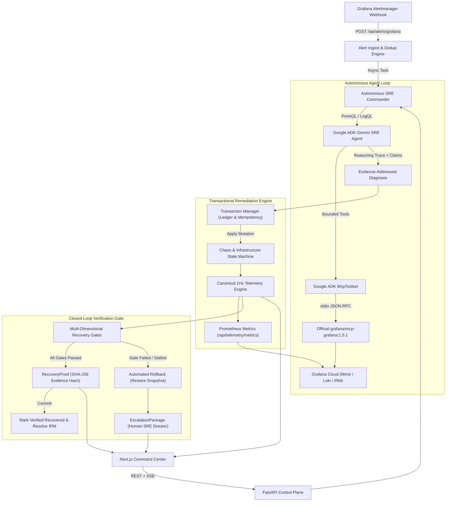

# CONTINUITY

## Overview

CONTINUITY is an autonomous, closed-loop SRE control plane for high-concurrency OTT video streaming architectures.
It connects Google Gemini, Grafana Cloud, the official Grafana MCP server, Prometheus/Mimir, Loki, and a transactional remediation control plane to automate the entire incident lifecycle:

```
Alert Ingest → Investigate → Diagnose → Transactional Remediation → Closed-Loop Verification → Recovery Proof / Rollback & Escalation
```

The system is built on one foundational reliability invariant:

> **COMMAND SUCCEEDED != SERVICE RECOVERED**

A remediation action succeeding at the control-plane level does not prove that end-user streaming QoS has restabilized. CONTINUITY executes remediation inside an isolated transaction, re-evaluates multi-dimensional streaming health gates against objective Prometheus and client telemetry, and commits the transaction with a cryptographic `RecoveryProof` only when metrics cross operational SLA thresholds. If convergence fails, CONTINUITY automatically triggers infrastructure rollback and compiles an `EscalationPackage` for human SRE handoff.

---

## Live System & Resources

| Resource | Description | Endpoint / URL |
|---|---|---|
| Command Center UI | Next.js Real-Time Control Center | [https://continuity-sre.pages.dev](https://continuity-sre.pages.dev) |
| Repository | Source Code & Test Suites | [https://github.com/bobybarack/continuity-sre](https://github.com/bobybarack/continuity-sre) |
| Backend API | FastAPI Production Control Plane | [https://continuity-api-121300560395.us-central1.run.app/](https://continuity-api-121300560395.us-central1.run.app/) |
| Grafana Dashboard | Live Streaming QoS & Chaos Board | [https://joyfuljasmine1550.grafana.net/public-dashboards/4cf5f0a12aee4d48a3ed18abd2c03db7](https://joyfuljasmine1550.grafana.net/public-dashboards/4cf5f0a12aee4d48a3ed18abd2c03db7) |
| Webhook Ingest | Grafana Alertmanager Event Endpoint | `POST /api/alerts/grafana` |
| Prometheus Metrics | QoS & Agent Self-Observability | `GET /api/telemetry/metrics` |
| MCP Tool Catalog | Discovered Official Grafana MCP Tools | `GET /api/agent/mcp-tools` |

---

## Core Engineering Invariants

1. **Transactional Remediation**: Infrastructure mutations are executed as ledgered transactions (`RemediationTransaction`) capturing pre-action snapshots (`previous_state`), intended state, and reverse rollback actions.
2. **Deterministic Closed-Loop Verification**: Incidents are never marked resolved based on action dispatch. Resolution requires passing explicit scenario-tailored recovery gates.
3. **Falsifiable Recovery Proofs**: Verified recoveries emit an immutable `RecoveryProof` artifact anchored by a cryptographic SHA-256 evidence hash covering pre-action telemetry, post-action telemetry, and gate results.
4. **Automated Rollback & Human Escalation**: Unverified convergence or adversarial degradation triggers automatic state rollback to pre-action baselines and assembles an `EscalationPackage` containing query logs, failed gates, and recommended remediation for human operators.
5. **Idempotency Guard**: All remediation actions are indexed by `{incident_id}:{action}:{version}` to prevent destructive duplicate execution across webhook retries.
6. **Per-Incident Concurrency Isolation**: Concurrent alerts and investigations targeting the same incident ID are serialized via asynchronous locks, returning existing results without racing.
7. **Agent Self-Observability in Grafana**: The autonomous agent instruments its own reasoning latency, tool calls, error rates, rollbacks, and gate outcomes directly into Prometheus for Grafana dashboarding.
8. **Evidence-Addressed Diagnosis**: Root-cause conclusions link directly to empirical PromQL and LogQL query outputs through structured `DiagnosisClaim` and `EvidenceReference` schemas.

---

## Architecture



---

## The Premiere Continuity Crew

CONTINUITY bridges the Agentic Cinema theme with real-world OTT streaming operations by framing multi-agent incident response around authentic Hollywood production set and master control room roles:

| Crew Member | On-Set Responsibility | Architectural Mapping & MCP Tools |
| :--- | :--- | :--- |
| **1st AD** *(First Assistant Director)* | Set commander running call sheet, directing emergency positions, and delivering post-incident wrap report. | **API Control Plane & Incident Commander**: Triggers multi-step investigation, acquires incident locks, tracks MTTR, and manages the transaction ledger. |
| **DIT** *(Digital Imaging Technician)* | On-set technical engineer inspecting raw digital camera feeds, pixel accuracy, bitrates, and card integrity. | **Grafana Observability Ingestion**: Queries Grafana Cloud Prometheus (`query_prometheus`) and Loki (`query_loki_logs`) for objective ground truth. |
| **Key Grip** *(Infrastructure Rigger)* | Master of physical cabling, power distribution, and backup generator switchovers. | **Transactional Remediation Control Plane**: Executes `continuity_execute_remediation` (shifting egress to secondary Akamai CDN, BGP rerouting, DRM key failover). |
| **Continuity Supervisor** | Detail guardian ensuring zero continuity breaks between takes. | **Closed-Loop Recovery Gate**: Enforces `Command Succeeded != Service Recovered`. Validates downstream buffer depth and VPF before stamping `VERIFIED_RECOVERED` or triggering rollback. |

---

## Technical Architecture Components

### 1. Direct Google ADK to Grafana MCP Integration

CONTINUITY runs the official Grafana Labs binary (`grafana/mcp-grafana:1.5.1`) via stdio transport using Google ADK's native `McpToolset`:

```
Google ADK Gemini SRE Agent
  ↓
Google ADK McpToolset (stdio session manager)
  ↓
Official grafana/mcp-grafana:1.5.1 binary
  ↓
Grafana Cloud (Prometheus / Mimir + Loki + Annotations + IRM Incidents)
```

- **Tool Filtering**: The official MCP binary exposes over 60 tools. CONTINUITY bounds the exposed surface using `ALLOWED_GRAFANA_TOOLS`:
  - `query_prometheus`: Real-time PromQL querying against Grafana Cloud Mimir.
  - `query_loki_logs`: LogQL log stream querying against Grafana Cloud Loki.
  - `create_annotation`: Visual timestamp placement on live operational dashboards.
  - `create_incident`: Structured incident declaration in Grafana Incident Response & Management (IRM).
  - `update_incident`: Incident resolution in Grafana IRM upon verified recovery.
- **Native Custom Tools**: Added alongside Grafana tools inside the agent's function calling context:
  - `continuity_execute_remediation`: Transactional policy application.
  - `continuity_verify_closed_loop_recovery`: Multi-dimensional health gate evaluation.
  - `continuity_rollback_remediation`: Reversal to pre-action baseline snapshot.
  - `continuity_escalate_incident`: Human operator dossier generation.

### 2. Event-Driven Incident Triggering

CONTINUITY supports event-driven webhook ingestion at `POST /api/alerts/grafana`:

```http
POST /api/alerts/grafana
X-Webhook-Secret: continuity-demo-secret-2026
Content-Type: application/json

{
  "status": "firing",
  "alerts": [
    {
      "status": "firing",
      "labels": {
        "alertname": "HighVideoPlaybackFailures",
        "severity": "CRITICAL",
        "region": "us-east-2"
      },
      "annotations": {
        "summary": "Fastly POP us-east-2 packet loss exceeds 68%"
      },
      "fingerprint": "cdn-outage-us-east-2"
    }
  ]
}
```

- **Authentication**: Validates incoming requests against `CONTINUITY_DEMO_KEY` via `X-Continuity-Demo-Key`, `X-Webhook-Secret`, `Authorization: Bearer`, or query parameter.
- **Deduplication Engine**: Uses an in-memory TTL cache (`_DEDUP_CACHE`) to suppress redundant alerts while an incident or remediation pipeline is active.
- **Classification**: Automatically classifies alert annotations and labels into failure modes (`CDN_OUTAGE`, `DRM_TIMEOUT`, `ISP_PEERING_DROP`) and triggers background investigation.

### 3. Remediation as a Transaction (`RemediationTransaction`)

Every remediation action is treated as a stateful transaction with complete pre-action state preservation:

```python
class RemediationTransaction(BaseModel):
    transaction_id: str
    incident_id: str
    action: str
    failure_mode: Optional[str] = None
    previous_state: Dict[str, Any]
    intended_state: Optional[Dict[str, Any]] = None
    applied_at: float
    idempotency_key: str
    rollback_action: Optional[str] = None
    status: Literal["PENDING", "APPLIED", "VERIFYING", "COMMITTED", "ROLLBACK_REQUIRED", "ROLLED_BACK", "FAILED"]
    proof: Optional[RecoveryProof] = None
```

- **Idempotency**: Checked against `idempotency_index` before execution. If `{incident_id}:{action}:{version}` is already in the ledger, the existing transaction is returned without re-applying mutations.
- **Rollback Mapping**:
  - `SHIFT_TRAFFIC_TO_AKAMAI` -> `RESTORE_PREVIOUS_TRAFFIC_SPLIT`
  - `FAILOVER_DRM_KEY_CLUSTER` -> `RESTORE_PREVIOUS_DRM_CLUSTER`
  - `REROUTE_BGP_TRANSIT` -> `RESTORE_PREVIOUS_TRANSIT_ROUTE`

### 4. Closed-Loop Verification & Cryptographic Recovery Proof

Recovery is evaluated against multi-dimensional health gates:

| Health Gate | Operational SLA Target | Evaluated Metric |
|---|---|---|
| **Video Playback Failures (VPF)** | <= 0.50% | `ott_video_playback_failures_ratio` |
| **Forward Playback Buffer** | >= 20.0 s | `ott_buffer_health_seconds` |
| **CDN Egress Latency** | <= 150.0 ms | `ott_cdn_egress_latency_ms` (CDN scenarios) |
| **DRM License Handshake** | <= 250.0 ms | `ott_drm_handshake_ms` (DRM scenarios) |
| **Delivered Stream Bitrate** | >= 10.0 Mbps | `ott_stream_bitrate_mbps` (ISP scenarios) |

When all gates pass, CONTINUITY stamps an immutable `RecoveryProof`:

```python
class RecoveryProof(BaseModel):
    incident_id: str
    remediation_transaction_id: str
    pre_action: HealthSnapshot
    post_action: HealthSnapshot
    verification_source: str
    authoritative: bool
    gates: List[RecoveryGateResult]
    verified_at: Optional[float]
    outcome: Literal["PASSED", "PENDING", "ROLLED_BACK", "ESCALATED"]
    evidence_hash: Optional[str]  # SHA-256 digest of pre, post, and gate evidence
```

### 5. Automated Rollback & Human Escalation (`EscalationPackage`)

If recovery gates fail validation, the system refuses to mark the incident resolved. Instead, it executes:

1. **State Rollback**: Reverts simulated infrastructure to `previous_state` using `chaos_manager.apply_rollback()`.
2. **Escalation Package Assembly**: Compiles an `EscalationPackage` containing:
   - Incident ID, failure mode, and severity.
   - List of attempted remediation actions and transaction IDs.
   - Explicit list of failed health gates and observed values.
   - Recommended next steps for human SRE operators.
   - PromQL and LogQL query strings for manual verification.
3. **Lifecycle Transition**: Advances state to `IncidentLifecycle.ESCALATED`.

### 6. Autonomous Agent Self-Observability in Prometheus

CONTINUITY instruments the SRE agent directly into the Prometheus registry (`PREMIERE_REGISTRY`):

| Metric Name | Type | Labels | Description |
|---|---|---|---|
| `continuity_agent_gemini_latency_seconds` | Histogram | `model`, `trigger_source` | Latency distribution of Gemini reasoning calls. |
| `continuity_agent_mcp_tool_calls_total` | Counter | `tool_name`, `status` | Total MCP tool invocations and execution status. |
| `continuity_agent_remediations_total` | Counter | `failure_mode`, `action`, `status` | Total remediations committed vs rolled back. |
| `continuity_agent_rollbacks_total` | Counter | `failure_mode`, `rollback_action` | Total rollbacks triggered due to unverified convergence. |
| `continuity_agent_escalations_total` | Counter | `failure_mode`, `reason` | Total human escalations dispatched. |
| `continuity_agent_verification_gate_total` | Counter | `failure_mode`, `gate_name`, `outcome` | Pass/fail counts for each closed-loop health gate. |

All metrics are scraped via `GET /api/telemetry/metrics` and visualized in Grafana Cloud.

### 7. Evidence-Addressed Diagnosis

Root-cause analysis is structured using formal schemas linking claims directly to query outputs:

```python
class EvidenceReference(BaseModel):
    query_type: str  # "promql" or "logql"
    query: str
    target_metric: str
    observed_value: Any
    threshold: Optional[str]
    status: str  # "BREACHED" or "NORMAL"
    timestamp: float

class DiagnosisClaim(BaseModel):
    subsystem: str
    claim: str
    evidence: List[EvidenceReference]
    confidence: float
```

---

## Failure Scenarios & Benchmarks

CONTINUITY models four distinct failure modes, including a double-fault adversarial scenario:

| Scenario | Injected Failure | Autonomous Remediation | Convergence Gate |
|---|---|---|---|
| **Edge CDN Failover** | Fastly edge POP packet loss (68%), 502 Bad Gateway | `SHIFT_TRAFFIC_TO_AKAMAI` (80% egress) | VPF <= 0.5%, Latency <= 150ms |
| **DRM Key Proxy Failover** | Widevine license timeouts (>2400ms), 504 Gateway | `FAILOVER_DRM_KEY_CLUSTER` (drm-failover) | VPF <= 0.5%, DRM Handshake <= 250ms |
| **ISP BGP Route Reroute** | ASN 3356 transit packet drop, bitrate degraded (3.2 Mbps) | `REROUTE_BGP_TRANSIT` (ASN 2914 backup) | VPF <= 0.5%, Bitrate >= 10.0 Mbps |
| **Adversarial Double-Fault** | Primary CDN outage active AND secondary path degraded | `SHIFT_TRAFFIC_TO_AKAMAI` | **Fails Convergence Gate** -> Automatic Rollback + Escalation |

### Repeatable Chaos Benchmarks (`benchmarks/run_scenarios.py`)

Run the automated chaos benchmark suite across all scenarios:

```bash
.venv/bin/python benchmarks/run_scenarios.py
```

Benchmark output from test execution:

```
==========================================================================================
SCENARIO                            | PASS RATE  | FALSE RESOLVE | MEAN MTTR  | STATUS  
------------------------------------------------------------------------------------------
Edge CDN Failover                   |    100.0%  |             0 |      6.42s | PASS    
DRM Key Proxy Failover              |    100.0%  |             0 |      5.95s | PASS    
ISP BGP Route Reroute               |    100.0%  |             0 |     13.28s | PASS    
Adversarial Double-Fault (Degraded) |    100.0%  |             0 | N/A (Rollback) | PASS    
==========================================================================================
Total Invariant False Resolutions: 0
Benchmark results saved to: benchmarks/benchmark_report.json

SUCCESS: 100% Closed-Loop Verification & Rollback Invariants Proven.
```

---

## API Reference

### Telemetry Endpoints
- `GET /api/telemetry/current`: Canonical streaming QoS telemetry snapshot.
- `GET /api/telemetry/stream`: Server-Sent Events (SSE) 1Hz live telemetry feed.
- `GET /api/telemetry/history`: Rolling 60-second telemetry window.
- `GET /api/telemetry/metrics`: Prometheus exposition endpoint (QoS + Agent Self-Observability).

### Incident & Remediation Endpoints
- `POST /api/alerts/grafana`: Event-driven webhook ingest for Grafana Cloud Alertmanager.
- `POST /api/investigate`: Trigger autonomous multi-step investigation loop.
- `GET /api/agent/mcp-tools`: Inspect runtime catalog of discovered official Grafana MCP tools.
- `POST /api/chaos/inject`: Inject failure scenario (`CDN_OUTAGE`, `DRM_TIMEOUT`, `ISP_PEERING_DROP`, `SECONDARY_PATH_DEGRADED`).
- `POST /api/chaos/reset`: Reset infrastructure to healthy normal operating baseline.
- `GET /healthz`: System health check and Grafana Cloud connectivity status.

---

## Local Development & Testing

### Prerequisites
- Python 3.11+ (or Python 3.14 venv)
- Node.js 20+ & npm
- Docker (optional, for containerized run)

### Setup

```bash
# 1. Clone repository
git clone https://github.com/bobybarack/continuity-sre.git
cd continuity-sre

# 2. Configure environment
cp .env.example .env
# Edit .env with GEMINI_API_KEY, GRAFANA_INSTANCE_URL, GRAFANA_TOKEN

# 3. Setup Python virtual environment
python3 -m venv .venv
source .venv/bin/activate
pip install -r backend/requirements.txt

# 4. Setup frontend
cd frontend
npm install
cd ..
```

### Running Test Suite

```bash
# Run complete test suite (129+ tests passing)
.venv/bin/pytest -v

# Run targeted subsystems
.venv/bin/pytest tests/test_event_driven_alerts.py
.venv/bin/pytest tests/test_remediation_transactions_rollback.py
.venv/bin/pytest tests/test_agent_observability.py
.venv/bin/pytest tests/test_incident_concurrency.py
.venv/bin/pytest tests/test_adversarial_scenario.py
.venv/bin/pytest tests/test_chaos_benchmarks.py
```

### Running Frontend & Backend Locally

```bash
# Start backend control plane (port 8000)
.venv/bin/uvicorn main:app --app-dir backend --reload --port 8000

# Start Next.js Command Center (port 3000)
cd frontend
npm run dev
```

---

## Production Deployment (Google Cloud Run)

The production control plane is containerized via a multi-stage Dockerfile that copies the official `mcp-grafana:1.5.1` binary from Grafana Labs and executes FastAPI with Python 3.11-slim.

Deploy via `deploy.sh`:

```bash
./deploy.sh
```

**Single-Instance Stateful Guarantee**:
Cloud Run is explicitly configured with:
```bash
--min-instances 1 \
--max-instances 1 \
--concurrency 80
```
This invariant ensures process-local simulation state, transaction ledgers, and deduplication caches remain coherent without requiring distributed database overhead for prototype validation.

---

## License

Licensed under the Apache License 2.0. See [LICENSE](LICENSE) for details.
