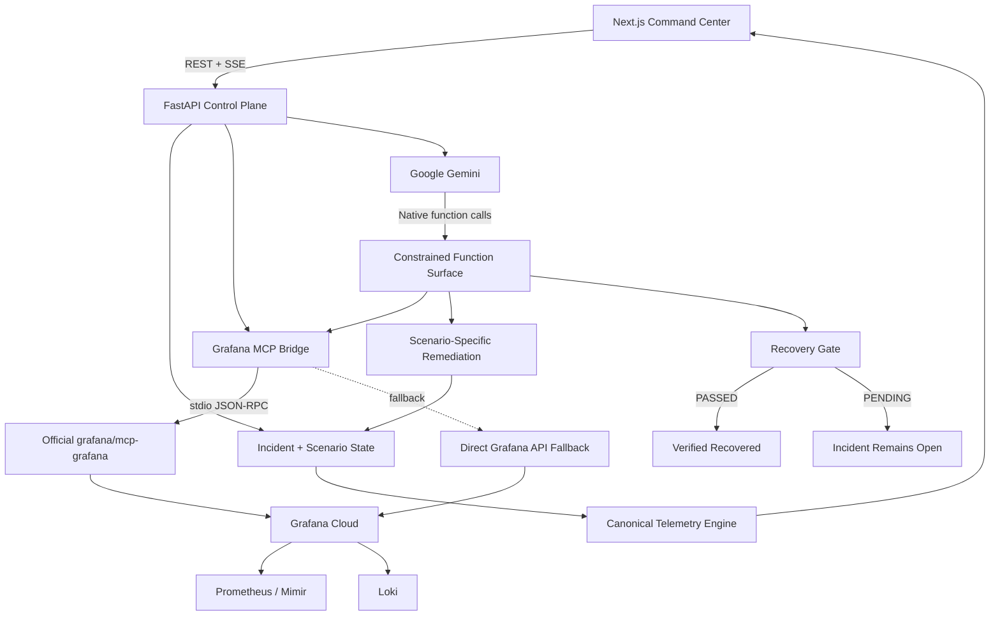

# CONTINUITY

## Overview

CONTINUITY is an agentic SRE prototype for high-concurrency video streaming systems.
It connects Google Gemini, Grafana Cloud, the official Grafana MCP server, Prometheus/Mimir, Loki, and a constrained remediation control plane to automate the incident lifecycle:

```
Detect → Investigate → Diagnose → Remediate → Record → Verify
```

The system is built around one reliability principle:

> A remediation command succeeding does not prove that the service recovered.

CONTINUITY observes the system again after an autonomous action and only marks an incident recovered when explicit health gates pass.

---

## Live

| Resource | Link |
|---|---|
| Repository | [https://github.com/bobybarack/continuity-sre](https://github.com/bobybarack/continuity-sre) |
| Backend API | [https://continuity-api-121300560395.us-central1.run.app/](https://continuity-api-121300560395.us-central1.run.app/) |
| Grafana Dashboard | [https://joyfuljasmine1550.grafana.net/public-dashboards/4cf5f0a12aee4d48a3ed18abd2c03db7](https://joyfuljasmine1550.grafana.net/public-dashboards/4cf5f0a12aee4d48a3ed18abd2c03db7) |

---

## Why CONTINUITY?

A live stream can fail even when the viewer's connection is completely healthy.
The viewer sees a loading spinner, degraded video, audio interruptions, or a playback error.

Behind the scenes, the infrastructure may already contain most of the evidence needed to understand the failure:
- rising playback failure rate
- CDN latency spikes
- collapsing forward-buffer depth
- DRM authentication delays
- degraded delivered bitrate
- HTTP 502 / 504 errors
- transit or peering degradation
- unhealthy traffic distribution

The difficult part is often what happens after detection.
A traditional incident flow can look like this:

```
Alert ↓ Page engineer ↓ Open dashboards ↓ Inspect metrics ↓ Search logs ↓ Correlate evidence ↓ Identify failure mode ↓ Choose remediation ↓ Execute change ↓ Observe telemetry ↓ Confirm recovery
```

Every individual step is reasonable.
The delay comes from requiring a person to continuously carry context between them.

CONTINUITY explores a narrower question:
> If the infrastructure already exposes enough evidence to understand an incident, how much of that response loop can be automated safely?

---

## How It Works

CONTINUITY implements six stages:
1. **Detect** abnormal streaming QoS
2. **Investigate** Prometheus metrics and Loki logs
3. **Diagnose** the failure with Gemini
4. **Remediate** through a constrained action surface
5. **Record** the incident in Grafana
6. **Verify** the resulting system state

The final stage is what makes the system closed-loop:

> Command executed ≠ Service recovered

---

## Architecture



At a high level:
```
Streaming degradation ↓ Prometheus + Loki evidence ↓ Grafana MCP ↓ Gemini reasoning ↓ Constrained remediation ↓ Recovery convergence ↓ Prometheus-backed verification ↓ PASSED / PENDING
```

---

## Incident Lifecycle

Failure type and incident lifecycle are deliberately modeled separately.

A failure may be:
```
CDN_OUTAGE
DRM_TIMEOUT
ISP_PEERING_DROP
```

while the lifecycle progresses independently:

```
NORMAL ↓ INCIDENT_ACTIVE ↓ REMEDIATION_APPLIED ↓ RECOVERING ├── VERIFIED_RECOVERED └── ESCALATED / PENDING
```

A remediation function is therefore not allowed to declare an incident recovered.
Recovery belongs to the verification stage.

---

## 1. Detect

CONTINUITY exposes streaming Quality of Service telemetry through Prometheus/OpenMetrics.

| Metric | Description |
|---|---|
| `ott_video_playback_failures_ratio` | Video playback failure ratio |
| `ott_cdn_egress_latency_ms` | CDN egress latency |
| `ott_drm_handshake_ms` | DRM license acquisition latency |
| `ott_active_viewers_count` | Simulated concurrent viewer count |
| `ott_buffer_health_seconds` | Forward playback buffer |
| `ott_stream_bitrate_mbps` | Delivered stream bitrate |
| `ott_cdn_traffic_split_percentage` | Traffic distribution by CDN |
| `ott_incident_active_status` | Active incident state |

Prometheus/OpenMetrics exposition:
```http
GET /api/telemetry/metrics
```

Current telemetry:
```http
GET /api/telemetry/current
```

Live telemetry:
```http
GET /api/telemetry/stream
```

The telemetry engine maintains one canonical system snapshot.
HTTP reads, SSE consumers, agent investigations, and Prometheus exposition observe that shared state instead of independently generating their own version of reality.

---

## 2. Investigate

When degradation is detected, CONTINUITY selects observability queries based on the active failure scenario.

- **CDN edge failure**:
  - `ott_video_playback_failures_ratio`
  - `{service="ott-edge-router"} |= "502 Bad Gateway"`
- **DRM timeout**:
  - `ott_drm_handshake_ms`
  - `{service="drm-auth-proxy"} |= "504 Gateway Timeout"`
- **ISP / transit degradation**:
  - `ott_stream_bitrate_mbps`
  - `{service="transit-monitor"} |= "ASN 3356"`

The returned Prometheus and Loki responses are included directly in Gemini's incident context alongside the structured application telemetry.
Gemini therefore reasons over observability evidence rather than receiving only a generic description of the incident.

### Official Grafana MCP Integration

CONTINUITY integrates with the official:
`grafana/mcp-grafana`
runtime.

The primary integration path is:
```
CONTINUITY ↓ MCP ClientSession ↓ stdio JSON-RPC ↓ mcp-grafana ↓ Grafana Cloud
```

The bridge can:
- locate the installed Grafana MCP binary
- initialize an MCP session
- dynamically discover the available tool catalog
- invoke supported Grafana tools
- normalize returned results for the application

The discovered runtime catalog can be inspected through:
```http
GET /api/agent/mcp-tools
```

CONTINUITY uses Grafana capabilities for operations including:
- `query_prometheus`
- `query_loki_logs`
- `create_annotation`
- `create_incident`
- `update_incident`
- `search_dashboards`

The complete Grafana MCP capability surface is larger than the subset exposed to Gemini.
That is intentional.

### Grafana REST Fallback

CONTINUITY also includes a direct Grafana HTTP client.
If a supported MCP operation cannot complete, the application can fall back to the corresponding Grafana API path.

```
Primary:  CONTINUITY ↓ mcp-grafana ↓ Grafana Cloud
Fallback: CONTINUITY ↓ Grafana HTTP Client ↓ Grafana Cloud
```

The HTTP client uses connection pooling and retry handling for transient network/server failures.

---

## 3. Diagnose

Gemini provides the reasoning layer through Google's official:
`google-genai`
SDK.

The model receives context including:
- active failure mode
- affected region
- playback failure rate
- CDN latency
- DRM handshake latency
- forward-buffer depth
- delivered bitrate
- current infrastructure event
- Prometheus query evidence
- Loki query evidence

It participates in determining:
- incident severity
- likely root cause
- affected subsystem
- appropriate remediation

### Constrained Gemini Function Calling

Gemini does not receive arbitrary system access.
The application exposes a narrow native function surface such as:
- `grafana_query_prometheus`
- `grafana_query_loki`
- `grafana_create_annotation`
- `grafana_create_incident`
- `continuity_execute_remediation`
- `continuity_verify_closed_loop_recovery`

Gemini may request these operations through Google GenAI native function calling.
The application then dispatches each requested operation through explicitly implemented handlers.

The design principle is:
> Reason broadly. Act narrowly. Verify everything.

### Hybrid Orchestration

CONTINUITY combines probabilistic model reasoning with deterministic application control.
Gemini can select tools, but lifecycle-critical stages do not depend entirely on the model remembering every operation.
The backend ensures that required stages such as remediation, incident recording, annotation, and verification occur when necessary.

```
Gemini reasoning + Native function calling + Deterministic orchestration + Explicit recovery gate
```

Infrastructure control therefore remains bounded even when the reasoning component is probabilistic.

---

## 4. Remediate

CONTINUITY currently models three remediation policies.

| Failure | Remediation |
|---|---|
| CDN outage | `SHIFT_TRAFFIC_TO_AKAMAI` |
| DRM timeout | `FAILOVER_DRM_KEY_CLUSTER` |
| ISP peering degradation | `REROUTE_BGP_TRANSIT` |

The actions modify different parts of the simulation state.

### CDN
A CDN failure can shift simulated traffic away from the degraded primary path toward the secondary route.

Example:
```
Primary CDN:   100% → 20%
Secondary CDN:   0% → 80%
```

### DRM
DRM remediation changes the active simulated key/license cluster rather than pretending the problem is a CDN routing failure.

### Transit
Transit remediation updates the simulated route/peering state associated with the network failure.

These actions are intentionally constrained.
CONTINUITY does not execute arbitrary shell commands or control real Fastly, Akamai, BGP, ISP, or DRM-provider production systems.

---

## 5. Record

Autonomous infrastructure actions should remain visible.

CONTINUITY can create:
- Grafana incident
- Grafana dashboard annotation

The incident record captures operational context around:
- severity
- diagnosis
- remediation
- lifecycle status

The annotation places a timestamped marker alongside the telemetry.
If recovery is verified, the incident can be updated to reflect resolution.
If verification remains pending, the incident remains unresolved.

---

## 6. Verify

Verification is the defining part of CONTINUITY.
A basic automation might do this:

```
Execute remediation ↓ Function returned successfully ↓ Declare success
```

CONTINUITY instead performs:

```
Observe ↓ Reason ↓ Act ↓ Observe Again ↓ Verify
```

The verification tool evaluates post-remediation telemetry against an explicit recovery gate.

Current health requirements include:

$$\text{VPF} \le 0.5\% \quad \land \quad L_{\text{CDN}} \le 150\text{ ms} \quad \land \quad B_{\text{forward}} \ge 20\text{ s}$$

where:
- $\text{VPF}$ is Video Playback Failure percentage
- $L_{\text{CDN}}$ is CDN egress latency
- $B_{\text{forward}}$ is forward-buffer depth

Conceptually:

$$\text{Recovered} = \text{PrometheusHealthy} \land \text{VPFHealthy} \land \text{LatencyHealthy} \land \text{BufferHealthy}$$

The result is either:
- **`PASSED`**
or:
- **`PENDING`**

A `PENDING` gate does not silently become a recovered incident.

### Verification Sources

CONTINUITY prefers Prometheus evidence returned through the configured Grafana integration.
The verification result records where its metric value came from.

Possible sources include:
- `grafana_cloud_prometheus`
- `prometheus_collector_registry`

Remote Grafana Cloud Prometheus evidence is distinguished from the local Prometheus registry fallback.
If no acceptable Prometheus value can be obtained, recovery cannot pass.
This makes the evidence source visible rather than hiding fallback behavior.

### Recovery Convergence

Remediation does not instantly turn the simulator healthy.
The system models a recovery period in which metrics converge toward their post-remediation state.

Conceptually:

```
Incident ↓ Remediation applied ↓ Recovering ↓ telemetry improves over time ↓ verification gate ├── PASS └── PENDING / ESCALATED
```

This allows remediation to be tested independently from recovery.
The system can therefore represent:
> action executed but service did not recover

which is essential to a meaningful closed loop.

---

## Failure Scenarios

### CDN Outage
Simulates:
- primary edge failure
- `502 Bad Gateway`
- elevated playback failures
- increased CDN latency
- buffer collapse
- bitrate degradation

### DRM Timeout
Simulates:
- DRM key/license acquisition delay
- `504 Gateway Timeout`
- elevated handshake latency
- resulting playback failures

### ISP Peering Degradation
Simulates:
- transit congestion
- packet loss / route degradation
- reduced delivered bitrate
- increased network latency
- player quality downshift

The synthetic scenario uses ASN 3356 as transit metadata.

---

## Command Center

The frontend is designed to show both sides of an incident:
- what the infrastructure sees
- what the viewer experiences

The interface surfaces:
- playback state
- video playback failure rate
- CDN latency
- DRM latency
- forward-buffer health
- delivered bitrate
- traffic distribution
- infrastructure events
- incident reasoning
- remediation activity
- recovery state

A typical demonstration is:

```
Healthy playback ↓ Inject failure ↓ QoS deteriorates ↓ Prometheus + Loki investigation ↓ Gemini analyzes evidence ↓ Controlled remediation ↓ Recovery converges ↓ Prometheus-backed verification ↓ Playback stabilizes
```

---

## Real vs. Simulated

CONTINUITY is a working agentic infrastructure prototype.
It is not a production CDN controller.

### Real
The repository contains real implementations for:
- Google Gemini API integration
- Google GenAI native function calling
- official Grafana MCP integration
- MCP stdio communication
- Grafana MCP tool discovery
- Grafana Cloud querying
- Prometheus/Mimir integration
- Loki integration
- Grafana dashboard annotations
- Grafana incident-management operations
- direct Grafana API fallback
- Prometheus/OpenMetrics exposition
- FastAPI APIs
- Server-Sent Events
- canonical telemetry state
- scenario-specific remediation logic
- post-remediation recovery verification
- explicit verification-source metadata
- Docker packaging
- Google Cloud deployment
- thread-safe simulation state

### Simulated
The prototype simulates:
- high-concurrency viewer load
- commercial CDN routing
- Fastly/Akamai traffic scenarios
- DRM infrastructure failures
- ISP/transit incidents
- viewer playback degradation
- production routing mutations
- subscriber/business-impact estimates

No real Fastly, Akamai, ISP, studio, streaming provider, or DRM production infrastructure is controlled by this repository.

---

## Safety Model

Autonomous infrastructure requires stronger boundaries than an ordinary conversational agent.
CONTINUITY therefore uses several controls.

- **Restricted function surface**: Gemini receives explicit tools rather than arbitrary execution access.
- **Scenario-specific actions**: The remediation layer only implements known actions supported by the control plane.
- **Grounded incident context**: Gemini receives telemetry and Grafana query evidence rather than only a natural-language alert.
- **Deterministic lifecycle control**: Critical stages are enforced by application code around the model.
- **Post-action verification**: Function execution is not considered evidence of recovery.
- **Fail-closed verification**: If acceptable verification evidence cannot be obtained, recovery does not pass.
- **Visible fallback behavior**: The application records whether verification came from remote Grafana Prometheus or the local registry fallback.
- **Auditability**: Investigation records preserve tool execution, remediation, Grafana references, timing, and verification state.

### Demo Write Guard

Public telemetry endpoints can remain readable for demonstration purposes.
Mutation operations such as chaos injection and autonomous investigation use a demo write guard.
This is intended to protect the hackathon demonstration from accidental mutation; it should not be interpreted as a production identity/authentication system.
A production deployment should use proper identity, authorization, secret management, and action-level policy enforcement.

---

## Tech Stack

### AI
- Google Gemini
- Google GenAI Python SDK
- native function calling

### Agent / MCP
- Model Context Protocol
- official `grafana/mcp-grafana`
- MCP Python SDK
- stdio JSON-RPC
- constrained tool dispatcher

### Observability
- Grafana Cloud
- Prometheus / Mimir
- Loki
- Grafana dashboard annotations
- Grafana Incident Management

### Backend
- Python 3.11+
- FastAPI
- Uvicorn
- Pydantic
- HTTPX
- Prometheus Client
- Server-Sent Events
- `threading.RLock()`

### Frontend
- Next.js 16
- React 19
- TypeScript
- Tailwind CSS 4
- Motion
- Hugeicons

### Infrastructure
- Docker
- Docker Compose
- Google Cloud Build
- Google Cloud Run
- Cloudflare Pages

### Testing
- Pytest
- Pytest AsyncIO
- concurrency and integration coverage

---

## Repository Structure

```
continuity-sre/
├── backend/
│   ├── routes/
│   │   ├── agent.py
│   │   ├── chaos.py
│   │   └── telemetry.py
│   ├── services/
│   │   ├── agent_commander.py
│   │   ├── chaos.py
│   │   ├── grafana_client.py
│   │   ├── mcp_service.py
│   │   ├── scenarios.py
│   │   └── telemetry.py
│   ├── config.py
│   ├── main.py
│   └── requirements.txt
├── frontend/
├── tests/
├── docs/
├── devpost-gallery/
├── video-production/
├── Dockerfile
├── docker-compose.yml
├── deploy.sh
├── LICENSE
└── README.md
```

---

## API

### Agent
```http
GET /api/agent/status
GET /api/agent/mcp-tools
POST /api/agent/investigate-and-remediate
GET /api/agent/history
```

### Telemetry
```http
GET /api/telemetry/current
GET /api/telemetry/history
GET /api/telemetry/grafana-health
GET /api/telemetry/metrics
GET /api/telemetry/stream
```

### Chaos Simulation
```http
GET /api/chaos/state
POST /api/chaos/inject-cdn-outage
POST /api/chaos/inject-drm-timeout
POST /api/chaos/inject-isp-drop
POST /api/chaos/remediate
POST /api/chaos/reset
```

Example remediation request:
```json
{
  "action": "SHIFT_TRAFFIC_TO_AKAMAI"
}
```

---

## Local Development

### Requirements
You need:
- Python 3.11+
- Node.js
- npm
- a Gemini API key

Live Grafana functionality additionally requires:
- Grafana Cloud stack
- Grafana service-account token
- Prometheus/Mimir datasource UID
- Loki datasource UID

### Clone
```bash
git clone https://github.com/bobybarack/continuity-sre.git
cd continuity-sre
```

### Environment
Create `.env` in the repository root:

```bash
# Gemini
GEMINI_API_KEY=your_gemini_api_key
GEMINI_MODEL=your_configured_gemini_model

# Google Cloud
GOOGLE_CLOUD_PROJECT=your_project_id
GOOGLE_CLOUD_PROJECT_NUMBER=your_project_number

# Grafana
GRAFANA_INSTANCE_URL=https://your-stack.grafana.net
GRAFANA_TOKEN=your_service_account_token
GRAFANA_PROM_UID=your_prometheus_datasource_uid
GRAFANA_LOKI_UID=your_loki_datasource_uid
GRAFANA_TEMPO_UID=your_tempo_datasource_uid

# Application
CORS_ALLOWED_ORIGINS=http://localhost:3000
CONTINUITY_DEMO_KEY=replace_me
```

Never commit `.env`.

### Backend
```bash
python3 -m venv .venv
source .venv/bin/activate
pip install -r backend/requirements.lock
```

Run:
```bash
uvicorn main:app \
  --app-dir backend \
  --host 0.0.0.0 \
  --port 8000 \
  --reload
```

- API: `http://localhost:8000`
- OpenAPI documentation: `http://localhost:8000/docs`

### Frontend
```bash
cd frontend
npm ci
npm run dev
```

### Docker
The production backend image uses a multi-stage build.
The Grafana MCP runtime is taken from a pinned `grafana/mcp-grafana` image and copied into the Python runtime.

Build:
```bash
docker build -t continuity-sre .
```

Run:
```bash
docker run \
  --env-file .env \
  -p 8080:8080 \
  continuity-sre
```

### Testing
Run the backend suite:
```bash
pytest -q
```

Build the frontend:
```bash
cd frontend
npm ci
npm run build
```

The test suite covers areas including:
- incident lifecycle
- scenario-specific remediation
- telemetry consistency
- Prometheus exposition
- Gemini orchestration
- recovery verification
- Grafana integration behavior
- concurrency-sensitive state

### Deployment
The repository includes:
```bash
./deploy.sh
```

The hackathon backend intentionally runs as a single Cloud Run instance because the simulation state is currently process-local.
That prevents one logical demo incident from being split across independent instances.
A production implementation would move incident and telemetry state into shared durable infrastructure before horizontal scaling.

### Controlled Benchmark
A controlled demo run recorded the incident-response loop at approximately:
**1.28 seconds**

This is a simulation benchmark, not a universal production MTTR claim.
Real-world recovery would depend on:
- model latency
- observability propagation
- MCP/API latency
- provider control-plane latency
- incident type
- topology
- traffic volume
- recovery convergence time

---

## Current Prototype Boundaries

CONTINUITY demonstrates the architecture of an autonomous closed-loop reliability system.
It is not presented as a finished production CDN controller.

- **Simulated actuation**: Infrastructure actions modify the controlled simulation, not commercial provider APIs.
- **Process-local state**: The hackathon deployment uses one backend instance intentionally. That prevents one logical demo incident from being split across independent instances. A horizontally scalable version would require shared state.
- **Verification policy**: Remote Grafana Prometheus is preferred for recovery evidence, with an explicitly identified local Prometheus fallback in the prototype. Production policy can require remote authoritative evidence exclusively.
- **Business-impact modeling**: Any viewer counts, churn numbers, or financial-impact values shown in demo fixtures are synthetic scenario values, not measured customer or revenue outcomes.
- **Security**: The demo write guard is not a substitute for production IAM, RBAC, tenant isolation, secret management, or approval workflows.

---

## Production Evolution

Natural next steps include:
- authenticated real infrastructure adapters
- shared durable incident state
- remote-only authoritative recovery verification
- richer multi-turn agent reasoning
- human escalation for unresolved incidents
- predictive degradation detection
- production IAM and authorization boundaries
- provider-specific rollback policies

The core control principle would remain unchanged:
```
Observe → Reason → Act → Observe Again → Verify
```

---

## Reliability Model

Let:
$S_t$ represent the observed infrastructure state before remediation.

Let:
$A_t$ represent an autonomous remediation action.

The action produces:
$$S_{t+1} = f(S_t, A_t)$$

Execution of $A_t$ is not itself the success condition.
Recovery requires:
$$S_{t+1} \in S_{\text{healthy}}$$

That changes the common agent loop from:
```
Observe → Think → Act
```
to:
```
Observe → Think → Act → Observe Again → Verify
```

That is the central idea behind CONTINUITY.

---

## Hackathon

CONTINUITY was built for Agentic Cinema: The Blockbuster Hackathon, with a focus on the Grafana Labs partner track.
The project explores how agentic systems can shorten the distance between observability and action without giving an LLM unrestricted control over production infrastructure.

---

## Disclaimer

CONTINUITY is an independent engineering prototype.
References to Fastly, Akamai, Widevine, FairPlay, Grafana, Google, network providers, film titles, studios, and streaming platforms are used to model or demonstrate infrastructure scenarios.
Unless explicitly stated otherwise, those references do not imply affiliation, endorsement, partnership, or production access to those organizations or systems.

---

## License

Licensed under the Apache License 2.0.
See [LICENSE](LICENSE).

---

## CONTINUITY

> Systems fail. The important part is what happens next.  
> CONTINUITY turns observable failure into controlled action—and controlled action back into measurable evidence of recovery.
