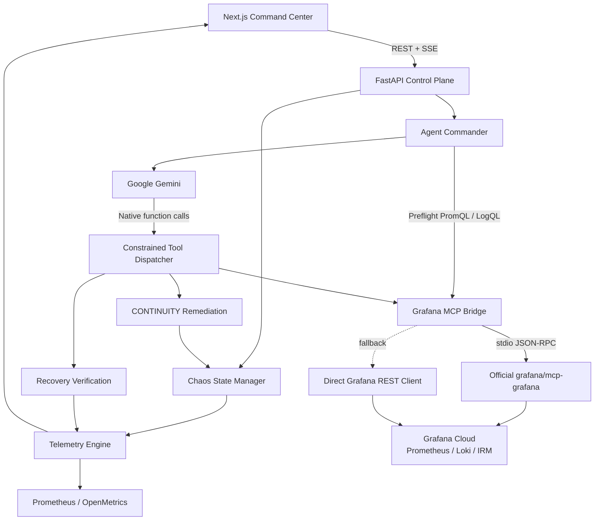

# CONTINUITY

### Closed-loop incident response for live streaming infrastructure

CONTINUITY is an autonomous SRE prototype that connects Google Gemini, Grafana Cloud, Prometheus/Mimir, Loki, the official Grafana MCP server, and a constrained remediation control plane.

It is built around one idea:

> Detecting an incident is not enough. A reliability system should investigate it, act on it, and verify that the system actually recovered.

```
Detect → Investigate → Diagnose → Remediate → Record → Verify
```

In the submitted demo scenario, CONTINUITY completed that closed loop in **1.28 seconds**.

> **Important:** The streaming environment and CDN failover are simulated. Grafana Cloud integration, Gemini calls, MCP bridging, Prometheus/OpenMetrics exposition, Loki/Grafana operations, annotations, API services, and deployment infrastructure are real.

---

## Live

- **Repository:** [https://github.com/bobybarack/continuity-sre](https://github.com/bobybarack/continuity-sre)
- **Cloud Run API:** [https://continuity-api-121300560395.us-central1.run.app/](https://continuity-api-121300560395.us-central1.run.app/)
- **Public Grafana Dashboard:** [https://joyfuljasmine1550.grafana.net/public-dashboards/4cf5f0a12aee4d48a3ed18abd2c03db7](https://joyfuljasmine1550.grafana.net/public-dashboards/4cf5f0a12aee4d48a3ed18abd2c03db7)

---

## Why CONTINUITY?

CONTINUITY started with a simple frustration.

A live stream can fail even when the viewer's connection is perfectly healthy. The viewer sees a buffering spinner, degraded video, or an error screen.

Behind the scenes, the infrastructure may already contain most of the evidence needed to understand what happened:
- playback failure metrics
- CDN latency
- buffer health
- bitrate degradation
- DRM latency
- edge errors
- transit failures
- routing state

The problem is often the gap between observability and action.

A conventional incident workflow can look like:
```
Alert → Page engineer → Open dashboards → Inspect metrics → Search logs → Correlate evidence → Choose remediation → Execute change → Watch the system → Confirm recovery
```

Every step makes sense.

But during a high-concurrency live event, every minute spent manually moving context between systems is another minute the viewer experiences the failure.

CONTINUITY explores a narrower question:
> If the infrastructure already exposes enough information to respond, how much of that incident loop can be safely automated?

---

## What CONTINUITY Does

CONTINUITY implements a six-stage incident lifecycle:
1. Detect abnormal streaming QoS
2. Investigate metrics and logs
3. Diagnose the active failure mode
4. Remediate through a constrained action surface
5. Record the incident in Grafana
6. Verify post-remediation health

The important part is the last step.

$$\text{Command executed} \neq \text{System recovered}$$

CONTINUITY does not use successful function execution alone as its recovery signal.

It checks the resulting telemetry against explicit health conditions and records whether the closed-loop verification passed.

---

## Architecture



The architecture deliberately separates:
- observation
- reasoning
- action
- verification

Gemini does not receive arbitrary shell access or unrestricted infrastructure control.

---

## Incident Lifecycle

### 1. Detect

CONTINUITY generates and exposes streaming Quality of Service telemetry including:

| Metric | Meaning |
| :--- | :--- |
| `ott_video_playback_failures_ratio` | Current playback failure ratio |
| `ott_cdn_egress_latency_ms` | CDN response latency |
| `ott_drm_handshake_ms` | DRM license handshake duration |
| `ott_active_viewers_count` | Simulated concurrent audience |
| `ott_buffer_health_seconds` | Client forward-buffer depth |
| `ott_stream_bitrate_mbps` | Delivered stream bitrate |
| `ott_cdn_traffic_split_percentage` | Traffic distribution by CDN |
| `ott_incident_active_status` | Active outage indicator |

Prometheus/OpenMetrics exposition is available at:
```
/api/telemetry/metrics
```

The frontend also receives live telemetry through a 1 Hz Server-Sent Events stream:
```
/api/telemetry/stream
```

The incident controller currently considers conditions such as elevated VPF, CDN latency, DRM latency, or an active chaos state when deciding whether investigation is necessary.

### 2. Investigate

When an anomaly is detected, the agent commander starts with observability preflight operations.

It calls the Grafana integration for:
- `grafana_query_prometheus`
- `grafana_query_loki`

The Grafana integration uses the official `mcp-grafana` runtime when available.

The bridge creates a live stdio JSON-RPC MCP session, initializes it, and calls the official Grafana tools.

Conceptually:
```
CONTINUITY → MCP ClientSession → mcp-grafana → Grafana Cloud
```

If the MCP binary is unavailable or an MCP operation fails, supported operations fall back to the direct Grafana client.

That gives the prototype two paths to the observability layer:
- **Primary:** CONTINUITY → official `mcp-grafana` → Grafana Cloud
- **Fallback:** CONTINUITY → Grafana REST APIs → Grafana Cloud

### Official Grafana MCP Integration

The production Docker image pulls the official Grafana MCP binary directly from:
```
grafana/mcp-grafana
```
and installs it into the CONTINUITY runtime.

At runtime, CONTINUITY can discover the official tool catalog through:
```http
GET /api/agent/mcp-tools
```

The endpoint returns:
- MCP connection status
- discovered binary path
- number of discovered tools
- runtime tool catalog

CONTINUITY does not expose that entire catalog to Gemini. That is intentional.

### Constrained Gemini Tool Surface

The application gives Gemini a deliberately small function-call surface.

The current native Gemini tool declarations are:
- `grafana_query_prometheus`
- `grafana_query_loki`
- `grafana_create_annotation`
- `grafana_create_incident`
- `continuity_execute_remediation`
- `continuity_verify_closed_loop_recovery`

This keeps the agent's action space narrow and auditable.

The design principle is:
> Reason broadly. Act narrowly. Verify everything.

Gemini receives structured incident context and may emit native function calls through the Google GenAI SDK.

CONTINUITY then dispatches those calls to the corresponding integration or remediation function.

If the model does not execute a lifecycle-critical stage itself, the orchestrator can still guarantee required stages such as remediation, incident recording, annotation, and verification.

This creates a hybrid architecture:
> Deterministic workflow + Gemini reasoning/tool selection + Constrained side effects

rather than giving an LLM unrestricted control of the system.

### Gemini Reasoning Layer

CONTINUITY uses the official `google-genai` Python SDK.

The configured Gemini model is controlled with:
```bash
GEMINI_MODEL=models/gemini-3.6-flash
```
and the agent includes fallback model candidates for resilience if a model call fails.

The model receives incident context including:
- current failure mode
- affected region
- playback failure rate
- CDN latency
- DRM handshake duration
- buffer depth
- delivered bitrate
- current edge-event context

Gemini then participates in selecting an appropriate constrained remediation.

Current remediation policies are:
- `SHIFT_TRAFFIC_TO_AKAMAI`
- `FAILOVER_DRM_KEY_CLUSTER`
- `REROUTE_BGP_TRANSIT`

### Controlled Remediation

The simulation begins in a healthy state with:
- Primary CDN: 100%
- Secondary CDN: 0%

For the CDN outage scenario, remediation moves the simulated routing state to:
- Primary CDN: 20%
- Secondary CDN: 80%

The important boundary is that this is a control-plane simulation. CONTINUITY does not currently modify real Fastly or Akamai production traffic.

The current remediation action updates the internal thread-safe chaos state, which then changes the telemetry emitted by the application.

That allows the complete autonomous control loop to be demonstrated safely and reproducibly.

### Closed-Loop Verification

The core reliability invariant in CONTINUITY is:

$$\text{action success} \neq \text{recovery}$$

After remediation, the verification function evaluates the new telemetry state against three conditions:

$$VPF \leq 0.5\%$$

$$L_{CDN} \leq 150\text{ ms}$$

$$B_{forward} \geq 20\text{ s}$$

where:
- $VPF$ is video playback failure percentage
- $L_{CDN}$ is CDN egress latency
- $B_{forward}$ is client forward-buffer depth

The recovery predicate is therefore:

$$\text{Recovered} = (VPF \leq 0.5) \land (L_{CDN} \leq 150) \land (B_{forward} \geq 20)$$

The verifier returns either:
```
PASSED
```
or:
```
PENDING
```
along with the measured values.

The result is stored on the investigation record as:
- `closed_loop_verified`
- `verified_vpf_rate`
- `verified_buffer_health_sec`

#### Current Verification Boundary

In the current prototype, the recovery gate evaluates a fresh snapshot from the CONTINUITY telemetry engine.

It does not yet require an independent post-remediation Grafana/Prometheus read-back before resolution.

Moving verification to an independent observability read-back is one of the next production-hardening steps.

### Grafana Incident Recording

CONTINUITY can write incident context back into Grafana.

The integration supports:
- `grafana_create_annotation`
- `grafana_create_incident`

Annotations create timestamped markers that make autonomous actions visible on the dashboard timeline.

For incident creation, the system first attempts the Grafana incident-management path.

If that operation is unavailable, the direct Grafana integration falls back to creating a dedicated incident annotation so that the event still has a visible audit record.

---

## Failure Simulation

CONTINUITY includes a controlled chaos engine for reproducing several classes of streaming incident.

### CDN Outage (`CDN_OUTAGE`)
Simulates:
- primary edge failure
- 502 Bad Gateway errors
- high playback failure rate
- CDN latency spike
- forward-buffer collapse
- bitrate degradation

### DRM Timeout (`DRM_TIMEOUT`)
Simulates:
- DRM licensing delays
- Widevine/FairPlay authentication failure
- multi-second key acquisition latency
- playback failures caused by license acquisition

### ISP Peering Degradation (`ISP_PEERING_DROP`)
Simulates:
- Tier-1 transit congestion
- packet loss
- reduced delivered bitrate
- increased network latency
- player quality downshift

---

## Real vs. Simulated

This distinction is important.

### Real
The repository currently contains real implementations for:
- Google Gemini API calls
- Google GenAI native function calling
- official Grafana `mcp-grafana` stdio integration
- MCP tool discovery
- Grafana Cloud API fallback
- Prometheus/OpenMetrics metric exposition
- Loki query integration
- Grafana annotations
- Grafana incident-management integration/fallback
- FastAPI APIs
- Server-Sent Events
- Docker packaging
- Google Cloud Run deployment
- thread-safe shared state
- constrained agent tool dispatch
- recovery verification logic

### Simulated
The prototype simulates:
- millions of concurrent viewers
- commercial CDN traffic
- Fastly edge failures
- Akamai failover traffic
- Tier-1 peering failures
- DRM infrastructure failures
- customer-facing streaming QoS
- production remediation

No production Fastly, Akamai, ISP, DRM provider, film studio, or streaming platform infrastructure is controlled by this repository.

---

## Hybrid Safety Model

Autonomous infrastructure systems need more than a capable model.

CONTINUITY therefore uses several deterministic safeguards around Gemini:

1. **Narrow function surface:** Gemini only receives explicit function declarations. It cannot issue arbitrary shell commands.
2. **Explicit remediation policies:** The agent chooses between known remediation labels instead of generating arbitrary infrastructure mutations.
3. **Orchestrator-enforced lifecycle:** Critical stages do not depend entirely on the model choosing to call them.
4. **Post-action measurement:** Remediation is followed by a separate health evaluation.
5. **Observable audit trail:** Tool calls, remediation state, annotations, incident IDs, and reasoning events are recorded in the investigation history.

---

## Resilience

CONTINUITY includes several fallback layers:

- **Gemini:** The agent can try alternate configured Gemini models when a model call fails.
- **Grafana MCP:** The preferred path uses the official `mcp-grafana` server over stdio. If that path fails, supported Grafana operations can fall back to the direct REST client.
- **Grafana Incident Management:** If structured incident creation is unavailable, CONTINUITY records the incident through a dedicated Grafana annotation instead.

This keeps the demo functional while making failures in external dependencies visible rather than silently hiding them.

---

## Thread Safety

The chaos simulator contains shared mutable state that can be read and modified concurrently by:
- telemetry requests
- SSE clients
- chaos injection
- remediation
- agent execution

State transitions are protected with:
```python
threading.RLock()
```
The state manager returns copied state objects rather than exposing its internal object directly.

---

## API

The FastAPI service exposes three main API groups.

### Agent
```http
GET  /api/agent/status
GET  /api/agent/mcp-tools
POST /api/agent/investigate-and-remediate
GET  /api/agent/history
```

- `GET /api/agent/status`: Returns Gemini configuration state, configured model, Google Cloud project, and investigation count.
- `GET /api/agent/mcp-tools`: Starts an official Grafana MCP session and returns the discovered tool catalog.
- `POST /api/agent/investigate-and-remediate`: Runs the full CONTINUITY incident workflow.

### Telemetry
```http
GET /api/telemetry/current
GET /api/telemetry/history
GET /api/telemetry/grafana-health
GET /api/telemetry/metrics
GET /api/telemetry/stream
```

- `/metrics` exposes Prometheus-compatible metrics.
- `/stream` provides a continuous SSE telemetry stream.

### Chaos
```http
GET  /api/chaos/state
POST /api/chaos/inject-cdn-outage
POST /api/chaos/inject-drm-timeout
POST /api/chaos/inject-isp-drop
POST /api/chaos/remediate
POST /api/chaos/reset
```

These endpoints allow the failure scenarios to be reproduced deterministically during the demo.

---

## Demo Flow

A typical demonstration is:

```
1. Reset the environment
   ↓
2. Observe healthy playback telemetry
   ↓
3. Inject CDN outage
   ↓
4. Watch VPF rise and buffer health collapse
   ↓
5. Trigger CONTINUITY
   ↓
6. Grafana Prometheus/Loki preflight runs
   ↓
7. Gemini receives incident context
   ↓
8. Constrained remediation executes
   ↓
9. Traffic state shifts 100/0 → 20/80
   ↓
10. Grafana incident + annotation are recorded
   ↓
11. Recovery telemetry is evaluated
   ↓
12. closed_loop_verified records the result
```

This makes the full lifecycle visible instead of demonstrating only an LLM response or a dashboard alert.

---

## Why the Command Center Includes Video

Infrastructure observability is easy to make technically impressive and difficult to make immediately understandable.

A metric like:
```
VPF = 4.85%
```
means something specific to an SRE.

For everyone else, a frozen video player communicates the same failure instantly.

CONTINUITY therefore connects the infrastructure state to the viewer-facing experience.

The intended demo sequence is:
```
Healthy playback
   ↓
Failure injected
   ↓
Playback quality degrades
   ↓
CONTINUITY investigates
   ↓
Remediation executes
   ↓
Telemetry recovers
   ↓
Playback stabilizes
```

The application shows both sides of an incident: what the infrastructure sees and what the viewer experiences.

---

## Tech Stack

### AI
- Google Gemini
- Google GenAI Python SDK
- native Gemini function calling
- configurable model fallback

### Observability
- Grafana Cloud
- official `grafana/mcp-grafana`
- Prometheus / Mimir
- Loki
- Grafana annotations
- Grafana Incident Management integration

### Backend
- Python 3.11
- FastAPI
- Uvicorn
- Pydantic
- HTTPX
- Prometheus Client
- MCP Python SDK
- Server-Sent Events
- `threading.RLock()`

### Frontend
- Next.js 16.3.4
- React 19.2.8
- TypeScript
- Tailwind CSS 4
- Motion
- Hugeicons

### Infrastructure
- Docker
- Docker Compose
- Google Cloud Run

### Testing
- Pytest
- Pytest AsyncIO

---

## Repository Structure

```
continuity-sre/
├── backend/
│   ├── routes/
│   │   ├── agent.py
│   │   ├── chaos.py
│   │   └── telemetry.py
│   ├── services/
│   │   ├── agent_commander.py
│   │   ├── chaos.py
│   │   ├── grafana_client.py
│   │   ├── mcp_service.py
│   │   └── telemetry.py
│   ├── config.py
│   ├── main.py
│   └── requirements.txt
├── frontend/
├── tests/
├── docs/
├── devpost-gallery/
├── video-production/
├── Dockerfile
├── docker-compose.yml
├── deploy.sh
├── LICENSE
└── README.md
```

---

## Running Locally

### Prerequisites
You need:
- Python 3.11+
- Node.js
- npm
- a Gemini API key
- a Grafana Cloud stack and service-account token for live Grafana operations

The official `mcp-grafana` binary is recommended for local development. If you use the provided Docker image, the binary is copied automatically from the official Grafana MCP image.

### 1. Clone the repository
```bash
git clone https://github.com/bobybarack/continuity-sre.git
cd continuity-sre
```

### 2. Configure environment variables
Create `.env` in the project root:
```bash
# Gemini
GEMINI_API_KEY=your_gemini_api_key
GEMINI_MODEL=models/gemini-3.6-flash

# Google Cloud
GOOGLE_CLOUD_PROJECT=your_project_id
GOOGLE_CLOUD_PROJECT_NUMBER=your_project_number

# Grafana Cloud
GRAFANA_INSTANCE_URL=https://your-stack.grafana.net
GRAFANA_TOKEN=your_service_account_token
GRAFANA_PROM_UID=your_prometheus_datasource_uid
GRAFANA_LOKI_UID=your_loki_datasource_uid
GRAFANA_TEMPO_UID=your_tempo_datasource_uid
```
*Never commit `.env`.*

### 3. Install backend dependencies
```bash
python3 -m venv .venv
source .venv/bin/activate
pip install -r backend/requirements.txt
```

### 4. Start the API
From the repository root:
```bash
uvicorn main:app \
  --app-dir backend \
  --host 0.0.0.0 \
  --port 8000 \
  --reload
```
The API will be available at: `http://localhost:8000`  
FastAPI's interactive documentation is available at: `http://localhost:8000/docs`

### 5. Start the frontend
In another terminal:
```bash
cd frontend
npm install
npm run dev
```

### Docker
The repository includes a multi-stage Docker build. One stage uses the official `grafana/mcp-grafana` image. The resulting MCP binary is copied into the Python runtime before the FastAPI service starts.

Build:
```bash
docker build -t continuity-sre .
```

Run:
```bash
docker run \
  --env-file .env \
  -p 8080:8080 \
  continuity-sre
```
Then open: `http://localhost:8080`

### Docker Compose
```bash
docker compose up --build
```
The service is exposed on: `http://localhost:8080`

---

## Testing

Run the backend test suite with:
```bash
pytest -q
```
The repository contains tests around the core backend behavior, telemetry, remediation, recovery workflow, and concurrency-sensitive state.

Test counts are intentionally not hard-coded into this README so that the documentation does not become stale when the suite changes.

---

## Google Cloud Run

A deployment script is included:
```bash
./deploy.sh
```
The script currently targets the project's configured Google Cloud project and `us-central1`. If you fork the repository, update the project and region values before deploying.

The production container listens on:
```
PORT=8080
```
as expected by Cloud Run.

---

## Configuration

| Variable | Purpose |
| :--- | :--- |
| `GEMINI_API_KEY` | Google Gemini API authentication |
| `GEMINI_MODEL` | Gemini model used by the agent |
| `GOOGLE_CLOUD_PROJECT` | Google Cloud project identifier |
| `GOOGLE_CLOUD_PROJECT_NUMBER` | Google Cloud project number |
| `GRAFANA_INSTANCE_URL` | Grafana Cloud instance URL |
| `GRAFANA_TOKEN` | Grafana service-account token |
| `GRAFANA_PROM_UID` | Prometheus/Mimir datasource UID |
| `GRAFANA_LOKI_UID` | Loki datasource UID |
| `GRAFANA_TEMPO_UID` | Tempo datasource UID |

---

## Current Prototype Boundaries

CONTINUITY demonstrates the architecture of an autonomous reliability loop. It is not presented as a production CDN controller.

The current branch has several deliberate or known boundaries.

### Simulated Actuation
Traffic changes affect the local simulation state, not real CDN infrastructure.

### Shared Remediation State
The prototype exposes several remediation policy names, but the current simulator converges them into the same generic `REMEDIATED` state. A production implementation would execute policy-specific actions against separate infrastructure systems.

### Reasoning Context
Grafana Prometheus and Loki preflight calls are executed, but the current Gemini incident prompt is primarily populated from the simulator's structured telemetry snapshot and latest generated event context. A deeper implementation would feed returned Prometheus/Loki payloads directly back into Gemini as first-class tool results across multiple reasoning turns.

### Verification Source
The current closed-loop verifier checks a fresh local telemetry snapshot. A production implementation should require an independent read-back from the authoritative observability plane before an incident may be closed.

### Recovery Enforcement
The verification result is recorded as `PASSED` or `PENDING` and exposed through `closed_loop_verified`. A production controller should explicitly prevent incident closure and escalate to a human whenever the recovery predicate remains false.

### Access Control
The current prototype uses permissive API/CORS settings for demonstration. A production deployment would require:
- authentication
- authorization
- restricted CORS
- service identities
- action-level permissions
- secret management
- approval boundaries for high-impact remediation

---

## Production Evolution

The next version of CONTINUITY would deepen four areas.

### 1. True Observability-Grounded Multi-Turn Reasoning
Instead of merely executing Grafana preflight operations, returned Prometheus and Loki data would become model-visible tool responses.

The agent loop would become:
```
Gemini requests metric
   ↓
MCP query executes
   ↓
Result returned to Gemini
   ↓
Gemini requests logs
   ↓
MCP query executes
   ↓
Result returned to Gemini
   ↓
Diagnosis
```
That makes the diagnosis fully traceable to observability evidence.

### 2. Independent Recovery Verification
The recovery gate should query the authoritative metrics source after remediation.

Conceptually:
```
Act
   ↓
Wait for telemetry propagation
   ↓
Query Prometheus through Grafana
   ↓
Evaluate SLA predicate
   ↓
PASS → resolve
FAIL → escalate
```

### 3. Real Infrastructure Adapters
The current simulated remediation boundary can be replaced with provider adapters for:
- CDN traffic management
- load balancers
- DNS
- service mesh routing
- DRM infrastructure
- cloud network controls

The reasoning layer would remain separated from the actual provider-specific action implementation.

### 4. Human Escalation
Autonomy should have a stopping condition. If recovery cannot be verified after an allowed remediation, CONTINUITY should stop making changes and escalate with:
- failure classification
- relevant metrics
- relevant logs
- attempted remediation
- current system state
- recommended next investigation step

The human engineer starts with context rather than starting from zero.

---

## Design Principles

- **Observe before acting:** The agent should receive measurable state, not a vague alert.
- **Constrain side effects:** The reasoning model should choose from explicitly implemented actions.
- **Separate execution from success:** A successful function return is not proof that users recovered.
- **Verify after every remediation:** Recovery must be an observable state transition.
- **Preserve an audit trail:** Every automated action should be inspectable afterward.
- **Escalate when certainty ends:** Autonomy should stop when the system can no longer prove that its actions improved the incident.

---

## The Core Idea

A conventional AI agent loop is often described as:

$$\text{Observe} \rightarrow \text{Think} \rightarrow \text{Act}$$

For infrastructure automation, that is incomplete.

CONTINUITY uses:

$$\text{Observe} \rightarrow \text{Think} \rightarrow \text{Act} \rightarrow \text{Observe Again} \rightarrow \text{Verify}$$

Formally, let:
- $S_t$ be the observed infrastructure state,
- $A_t$ be the remediation action, and
- $S_{t+1}$ be the resulting state.

The system executes:

$$S_{t+1} = f(S_t, A_t)$$

but the action is only useful if:

$$S_{t+1} \in S_{\text{healthy}}$$

That distinction is the central idea behind CONTINUITY.

---

## Hackathon

CONTINUITY was built for Agentic Cinema: The Blockbuster Hackathon, with a focus on the Grafana Labs partner track.

The project explores how agentic systems can shorten the distance between observability and action while maintaining explicit boundaries around what an AI is allowed to change.

---

## Disclaimer

CONTINUITY is an independent technical prototype.

Names such as Fastly, Akamai, Grafana, Google, Widevine, and film/streaming titles appearing in the simulator are used to demonstrate an infrastructure scenario.

The project does not imply affiliation with, endorsement by, or production access to those companies or services unless explicitly stated.

---

## License

Licensed under the Apache License 2.0.  
See [LICENSE](LICENSE).

---

### CONTINUITY

Infrastructure failures will happen.  
The real question is what the system does after it notices.

CONTINUITY turns observable failure into controlled action—and controlled action back into measurable evidence of recovery.
