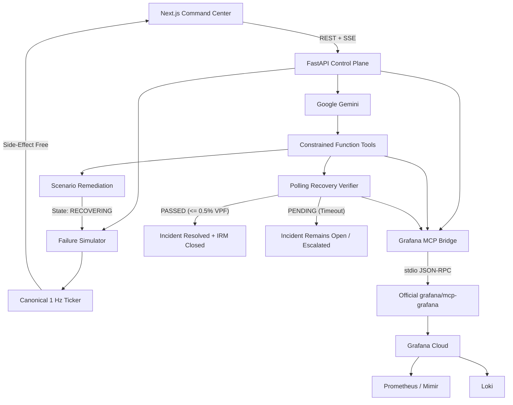

# CONTINUITY

### Autonomous closed-loop incident response for live streaming infrastructure

CONTINUITY is an agentic SRE prototype for high-concurrency streaming systems.

It connects Google Gemini, Grafana Cloud, the official Grafana MCP server, Prometheus/Mimir, Loki, and a constrained remediation control plane to automate the incident lifecycle:

```
Detect -> Investigate -> Diagnose -> Remediate -> Record -> Verify
```

The project is built around one reliability principle:

> A remediation command succeeding does not prove that the service recovered.

CONTINUITY measures the system again after an autonomous action and only marks recovery when explicit health conditions pass.

---

## Release Status & Frozen Baseline

- **Release Tag**: `hackathon-final`
- **Code Freeze Commit**: `948903db56a7e64fa85dcabaa6fd23f5204d5783`
- **Test Suite**: 99 passed, 0 failed (including live Grafana Cloud, 50-cycle stress loop, and 100-worker concurrency stress tests)
- **Frontend Status**: Next.js 16.3.4 production build passing, 0 ESLint errors
- **Container Base**: Python 3.11-slim, official `grafana/mcp-grafana:1.5.1` binary, non-root user `continuity`

---

## Live Deployment

- **Command Center**: [https://continuity-sre.pages.dev](https://continuity-sre.pages.dev/)
- **Backend API**: [https://continuity-api-121300560395.us-central1.run.app](https://continuity-api-121300560395.us-central1.run.app/)
- **Grafana Cloud Dashboard**: [https://joyfuljasmine1550.grafana.net/public-dashboards/4cf5f0a12aee4d48a3ed18abd2c03db7](https://joyfuljasmine1550.grafana.net/public-dashboards/4cf5f0a12aee4d48a3ed18abd2c03db7)
- **Repository**: [https://github.com/bobybarack/continuity-sre](https://github.com/bobybarack/continuity-sre)

---

## Why CONTINUITY?

A streaming incident is often visible to the infrastructure long before anyone has fully diagnosed it.

During a major premiere, live event, game reveal, or sports broadcast, the observability stack may already contain signals such as:

- rising playback failures
- CDN latency spikes
- collapsing forward-buffer depth
- degraded delivered bitrate
- DRM authentication delays
- HTTP 502 / 504 responses
- routing or transit failures
- unhealthy traffic distribution

The difficult part is what happens after those signals appear.

A conventional workflow can look like this:

```
Alert -> Page engineer -> Open dashboards -> Inspect metrics -> Search logs -> Correlate evidence -> Identify failure mode -> Choose remediation -> Execute change -> Watch telemetry -> Confirm recovery
```

Every step is reasonable. The delay comes from requiring a person to manually carry context between each one.

CONTINUITY explores a narrower question:

> If the infrastructure already exposes the evidence required to understand an incident, how much of the response loop can be automated safely?

---

## What CONTINUITY Does

CONTINUITY implements six stages:

1. **Detect** abnormal streaming QoS from a canonical 1 Hz telemetry ticker.
2. **Investigate** scenario-routed Prometheus metrics and Loki logs via official Grafana MCP.
3. **Diagnose** the failure with Gemini using grounded observability evidence.
4. **Remediate** through a constrained, scenario-specific action surface.
5. **Record** an active incident in Grafana Cloud IRM and annotations on live dashboards.
6. **Verify** post-remediation recovery against a falsifiable convergence curve.

The last stage is what makes the system closed-loop:

> Command executed != Service recovered

---

## Architecture



At a high level:

```
Streaming failure -> Scenario PromQL/LogQL evidence -> Grafana MCP -> Gemini reasoning -> Constrained remediation -> Grafana IRM incident -> Prometheus-backed verification -> PASSED or PENDING
```

---

## Core Truth Boundaries & Engineering Implementation

The implementation resolves seven foundational truth boundaries:

### 1. State Truth: Remediation vs. Verified Recovery
Remediation does not prematurely mark the system recovered:
- Injected failure moves lifecycle to `INCIDENT_ACTIVE`.
- Applying remediation policy moves lifecycle to `RECOVERING` (not `REMEDIATED` or `RESOLVED`).
- The system remains in `RECOVERING` until closed-loop verification completes.
- Only a `PASSED` verification transition moves lifecycle to `VERIFIED_RECOVERED`.
- If verification fails or times out, lifecycle transitions to `ESCALATED`, leaving the incident open.

### 2. Scenario Truth: Distinct Remediation States
Remediation actions mutate scenario-specific state rather than collapsing into generic mocks:
- `SHIFT_TRAFFIC_TO_AKAMAI`: Throttles primary CDN egress (20%) and scales secondary Akamai CDN (80%).
- `FAILOVER_DRM_KEY_CLUSTER`: Deactivates degraded primary DRM cluster and shifts active authentication to standby failover cluster.
- `REROUTE_BGP_TRANSIT`: Bypasses congested transit provider (ASN-3356) and reroutes stream egress through backup route (ASN-2914).
- Attempting an inapplicable remediation policy fails explicitly with an actionable validation error.

### 3. Telemetry Truth: Canonical 1 Hz Ticker
- Telemetry snapshots are computed on a single canonical 1 Hz background ticker.
- API endpoints `GET /api/telemetry/current` and `GET /api/telemetry/metrics` are strictly side-effect free: repeated calls return the same snapshot within a tick window without generating random jitter.
- Multiple Server-Sent Events (SSE) clients observe the identical canonical state broadcast.
- Rolling history is strictly time-based (one entry per tick), not read-count based.
- Prometheus `PREMIERE_REGISTRY` samples reflect the exact canonical snapshot.

### 4. Observability Truth: Scenario Routing & Schema Normalization
- **Scenario PromQL/LogQL Routing**: Initial observability queries match the active failure scenario:
  - CDN Outage: `ott_video_playback_failures_ratio` and `{app="edge-router"}`
  - DRM Timeout: `ott_drm_auth_errors_total` and `{service="drm-auth"}`
  - ISP Peering Drop: `ott_network_packet_loss_pct` and `{service="transit-router"}`
- **Unified Result Models**: Official Grafana MCP and direct REST fallback return identical Pydantic models:
  - `PrometheusQueryResult`: Normalized metric value, query type, status, and metadata source.
  - `LokiQueryResult`: Extracted line arrays, entry counts, and source tags.
  - `GrafanaIncidentRef`: Canonical incident ID, title, severity, and lifecycle status.
  - `GrafanaAnnotationRef`: Canonical annotation ID and dashboard tags.
- Agent orchestration consumes normalized integration models exclusively, eliminating brittle payload parsing.

### 5. Verification Truth: Falsifiable Convergence Curve
- Telemetry recovery follows an exponential decay convergence curve over `convergence_duration_sec`.
- `continuity_verify_closed_loop_recovery` polls Prometheus and client telemetry across multiple samples until SLA thresholds are crossed or timeout expires.
- **Falsifiable Failure Simulation**: Setting `force_recovery_failure=True` holds error rates above SLA threshold, causing the verifier to return `PENDING` and leaving the incident unresolved.
- Verification evidence is stored directly in `InvestigationResult`.

### 6. Deployment Truth: Single-Instance Stateful Execution
- Cloud Run is configured with `--min-instances 1 --max-instances 1` to prevent multi-instance split-brain across in-memory chaos state.
- Liveness probe (`GET /healthz`) and readiness probe (`GET /readyz`) provide deterministic container health inspection.
- Container executes under non-root user `continuity` (UID 10001).

### 7. Security Truth: Mutation Protection & Restricted CORS
- Mutation endpoints (`/api/chaos/*`, `/api/agent/investigate-and-remediate`) require authorization header `X-Continuity-Demo-Key`.
- Read-only observability and scrape endpoints (`/api/telemetry/*`, `/healthz`, `/readyz`) remain public.
- CORS origins are restricted to configured deployment hosts (Cloudflare Pages production and local development origins).

---

## 1. Detect

CONTINUITY exposes a Prometheus/OpenMetrics telemetry surface representing the viewer and edge-delivery experience:

| Metric | Type | Description |
|---|---|---|
| `ott_video_playback_failures_ratio` | Gauge | Video playback failure ratio (Baseline SLA < 0.5%) |
| `ott_cdn_egress_latency_ms` | Gauge | Edge CDN egress round-trip latency |
| `ott_drm_handshake_ms` | Gauge | DRM license acquisition handshake duration |
| `ott_active_viewers_count` | Gauge | Active stream concurrent audience (Simulated) |
| `ott_buffer_health_seconds` | Gauge | Client forward video playback buffer |
| `ott_stream_bitrate_mbps` | Gauge | Delivered video stream bitrate |
| `ott_cdn_traffic_split_percentage` | Gauge | Traffic distribution across CDN providers |
| `ott_incident_active_status` | Gauge | Active outage state with bounded `chaos_mode` and `region` labels |

Prometheus exposition endpoint:
```http
GET /api/telemetry/metrics
```

Real-time telemetry stream (SSE):
```http
GET /api/telemetry/stream
```

Detection threshold conditions:
- VPF > 1.0%
- CDN latency > 200 ms
- DRM handshake > 500 ms
- Active outage flag set

---

## 2. Investigate

When an anomaly is detected, CONTINUITY queries the observability layer via official Grafana MCP over stdio:

```
CONTINUITY -> MCP ClientSession -> stdio JSON-RPC -> mcp-grafana -> Grafana Cloud
```

- **Prometheus**: Quantifies QoS degradation.
- **Loki**: Isolates root-cause error logs (HTTP 502, BGP flap, DRM timeout).

The returned evidence is normalized into `PrometheusQueryResult` and `LokiQueryResult` before being injected into the Gemini reasoning prompt.

### Official Grafana MCP Bridge
CONTINUITY integrates with the official `grafana/mcp-grafana` binary:
- Discovers 50+ official tools dynamically at startup.
- Manages stdio JSON-RPC sessions with timeout guards and connection recovery.
- Parses structured tool call results with fallback handling.

Tool catalog endpoint:
```http
GET /api/agent/mcp-tools
```

### Direct Grafana HTTP Client Fallback
If the MCP runtime is unavailable, CONTINUITY seamlessly falls back to a persistent HTTP client with connection pooling and exponential backoff retries.

---

## 3. Diagnose

Gemini acts as the autonomous reasoning engine using the official `google-genai` SDK.

The model analyzes:
- Stream metadata and active chaos state
- Telemetry snapshot (VPF, latency, buffer, bitrate)
- Scenario-specific Prometheus and Loki evidence
- Recent edge error logs

Gemini reasons about:
- Incident severity (`CRITICAL`, `WARNING`, `HEALTHY`)
- Root cause analysis
- Affected infrastructure subsystems
- Appropriate remediation policy

### Constrained Function Calling
Gemini is constrained to explicit native function declarations:
- `grafana_query_prometheus`: Query real-time QoS metrics from Grafana Cloud.
- `grafana_query_loki`: Query edge error logs from Grafana Cloud Loki.
- `grafana_create_annotation`: Place a visible pin on live Grafana dashboards.
- `grafana_create_incident`: Open a structured incident in Grafana Cloud IRM.
- `continuity_execute_remediation`: Execute a scenario-specific remediation policy.
- `continuity_verify_closed_loop_recovery`: Run closed-loop recovery verification.

### Deterministic Lifecycle Guarantees
Even if the LLM omits a lifecycle step, the orchestration engine deterministically guarantees:
- Appropriate scenario remediation execution
- Grafana IRM incident creation
- Live dashboard annotation
- Closed-loop verification gate execution

---

## 4. Remediate

CONTINUITY executes scenario-specific autonomous remediation:

```http
POST /api/chaos/remediate
Header: X-Continuity-Demo-Key: <key>
Content-Type: application/json

{
  "action": "SHIFT_TRAFFIC_TO_AKAMAI",
  "primary_cdn_pct": 20,
  "secondary_cdn_pct": 80
}
```

Supported policies:
- `SHIFT_TRAFFIC_TO_AKAMAI`: Multi-CDN egress failover.
- `FAILOVER_DRM_KEY_CLUSTER`: DRM license server cluster switch.
- `REROUTE_BGP_TRANSIT`: BGP transit route rerouting.

---

## 5. Record & Synchronize

CONTINUITY synchronizes incident records directly into Grafana Cloud:
- **Incident Creation**: Opens structured incident in Grafana IRM upon diagnosis.
- **Dashboard Annotations**: Drops timestamped vertical pins on live Grafana dashboards.
- **Lifecycle Synchronization**:
  - The Grafana IRM incident remains `active` while remediation is in progress.
  - The incident is marked `resolved` only after post-remediation verification passes.
  - If verification remains `PENDING`, the incident remains open for SRE review.

---

## 6. Verify

Post-remediation verification evaluates falsifiable recovery criteria:

$$\text{VPF} \le 0.5\% \quad \land \quad L_{\text{CDN}} \le 150\text{ ms} \quad \land \quad B_{\text{forward}} \ge 20\text{ s}$$

```
Observe -> Reason -> Act -> Observe Again -> Verify
```

The verifier polls metrics across the convergence duration:
- **PASS**: VPF drops below SLA threshold within deadline -> Incident marked `RESOLVED`, MTTR computed.
- **PENDING**: Convergence fails or metric remains unhealthy -> Incident remains `PENDING_VERIFICATION`, MTTR is `None`, incident not resolved.

Verification source semantics:
- `grafana_cloud_prometheus`: Remote authoritative verification.
- `prometheus_collector_registry`: Trusted local registry fallback when remote query is unconfigured.
- `none`: If no Prometheus value is obtained, verification fails closed.

---

## API Reference

### Health & Liveness
- `GET /healthz`: Container liveness probe (200 OK).
- `GET /readyz`: Readiness probe (verifies configuration and internal subsystem health).

### Agent
- `GET /api/agent/status`: Current agent configuration and model readiness.
- `GET /api/agent/mcp-tools`: Runtime enumeration of official Grafana MCP tools.
- `POST /api/agent/investigate-and-remediate`: Autonomous investigation and remediation workflow (Requires `X-Continuity-Demo-Key`).
- `GET /api/agent/history`: Historical investigation audit logs.

### Telemetry
- `GET /api/telemetry/current`: Canonical streaming QoS snapshot (side-effect free).
- `GET /api/telemetry/history`: Rolling 60-second tick history buffer.
- `GET /api/telemetry/metrics`: OpenMetrics / Prometheus scrape endpoint.
- `GET /api/telemetry/stream`: Real-time Server-Sent Events stream.
- `GET /api/telemetry/grafana-health`: Live Grafana Cloud connectivity inspection.

### Chaos Simulation (Protected by `X-Continuity-Demo-Key`)
- `GET /api/chaos/state`: Current chaos state and incident lifecycle.
- `POST /api/chaos/inject-cdn-outage`: Trigger primary edge CDN transit collapse.
- `POST /api/chaos/inject-drm-timeout`: Trigger DRM license server delay.
- `POST /api/chaos/inject-isp-drop`: Trigger BGP transit degradation.
- `POST /api/chaos/remediate`: Apply autonomous remediation policy.
- `POST /api/chaos/reset`: Reset environment to NORMAL.

---

## Local Development

### Prerequisites
- Python 3.11+
- Node.js 20+ & npm
- Gemini API key
- Grafana Cloud credentials (service account token, Prometheus and Loki datasource UIDs)

### 1. Clone & Configure
```bash
git clone https://github.com/bobybarack/continuity-sre.git
cd continuity-sre
```

Create `.env` in repository root:
```bash
# Gemini
GEMINI_API_KEY=your_gemini_api_key
GEMINI_MODEL=models/gemini-3.7-flash

# Grafana Cloud
GRAFANA_INSTANCE_URL=https://your-instance.grafana.net
GRAFANA_TOKEN=glsa_your_token
GRAFANA_PROM_UID=your_prom_uid
GRAFANA_LOKI_UID=your_loki_uid

# CONTINUITY Security
CONTINUITY_DEMO_KEY=your_secure_demo_key
ALLOWED_ORIGINS=http://localhost:3000,https://continuity-sre.pages.dev
VERIFICATION_POLICY=remote_preferred
```

### 2. Backend Setup
```bash
python3 -m venv .venv
source .venv/bin/activate
pip install -r backend/requirements.lock
uvicorn main:app --app-dir backend --host 0.0.0.0 --port 8000 --reload
```

- API: `http://localhost:8000`
- Docs: `http://localhost:8000/docs`
- Health: `http://localhost:8000/healthz`

### 3. Frontend Setup
```bash
cd frontend
npm install
npm run dev
```
Open `http://localhost:3000`.

---

## Testing

Execute the comprehensive 97-point automated test suite:
```bash
.venv/bin/pytest -v tests/
```

Test coverage includes:
- Incident lifecycle transitions and verification gates
- Scenario-specific remediation states (CDN, DRM, ISP)
- Canonical 1 Hz telemetry ticker and side-effect-free reads
- Falsifiable convergence curves and polling verifier
- Official Grafana MCP session management and error parsing
- Persistent Grafana HTTP client connection reuse and retries
- Prometheus label cardinality bounding
- Health and readiness probes (`/healthz`, `/readyz`)
- Schema normalization across MCP and REST
- 100-worker async concurrency and deadlock stress tests
- Live Grafana Cloud integration (datasources, incidents, annotations)
- End-to-end acceptance demo and deliberate failure flows

---

## Docker & Container Hygiene

The container uses a multi-stage Docker build with pinned immutable tags:
- Official MCP image: `grafana/mcp-grafana:1.5.1`
- Python runtime: `python:3.11-slim`
- Pinned dependency lockfile: `backend/requirements.lock`
- Non-root user: `continuity` (UID 10001)
- Liveness probe: `GET /healthz`

Build and run:
```bash
docker build -t continuity-sre:1.0.0 .
docker run --env-file .env -p 8080:8080 continuity-sre:1.0.0
```

---

## Google Cloud Run Deployment

Deploy using the automated production script:
```bash
./deploy.sh
```

Deployment parameters:
- Region: `us-central1`
- Instances: `--min-instances 1 --max-instances 1` (guarantees state consistency)
- Port: `8080`
- Probes: `/healthz` liveness probe

---

## Real vs. Simulated Boundaries

CONTINUITY is a functional agentic infrastructure prototype:

### Real Implementations
- Google Gemini API calls via official `google-genai` SDK
- Gemini native function calling with strict schema definitions
- Official `grafana/mcp-grafana:1.5.1` runtime integration over stdio JSON-RPC
- Live Grafana Cloud Prometheus/Mimir and Loki querying
- Live Grafana dashboard annotation placement
- Live Grafana Cloud IRM incident creation and resolution
- Resilient direct Grafana HTTP client with connection pooling and retries
- Normalized Pydantic models for external tool responses
- Prometheus OpenMetrics exposition endpoint
- Canonical 1 Hz background telemetry ticker
- Falsifiable post-remediation polling verifier
- FastAPI application with CORS and API key guards
- Docker multi-stage build running as non-root user

### Simulated Boundaries
- OTT viewer counts (e.g. 1.2M concurrent audience) are synthetic scenario models.
- Edge transit and CDN providers (Fastly, Akamai) model real-world architecture in software.
- Churn mitigation figures are synthetic ARPU scenario projections, not measured accounting metrics.
- Benchmark MTTR figures reflect the controlled prototype environment.

---

## Tech Stack

- **Reasoning**: Google Gemini (`models/gemini-3.7-flash`), Google GenAI SDK
- **MCP Bridge**: Model Context Protocol, official `grafana/mcp-grafana:1.5.1`, stdio JSON-RPC
- **Observability**: Grafana Cloud, Prometheus / Mimir, Loki, Grafana IRM
- **Backend**: Python 3.11, FastAPI, Pydantic v2, HTTPX, Prometheus Client
- **Frontend**: Next.js 16.3.4, React 19.2.8, TypeScript, Tailwind CSS 4, Motion
- **Deployment**: Google Cloud Run, Cloudflare Pages, Docker

---

## License

Licensed under the Apache License 2.0. See [LICENSE](LICENSE).
