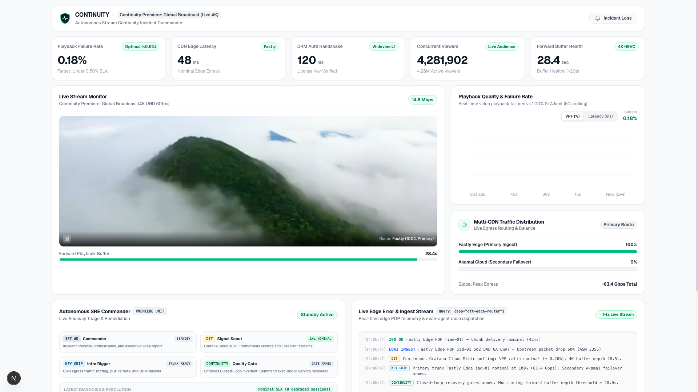
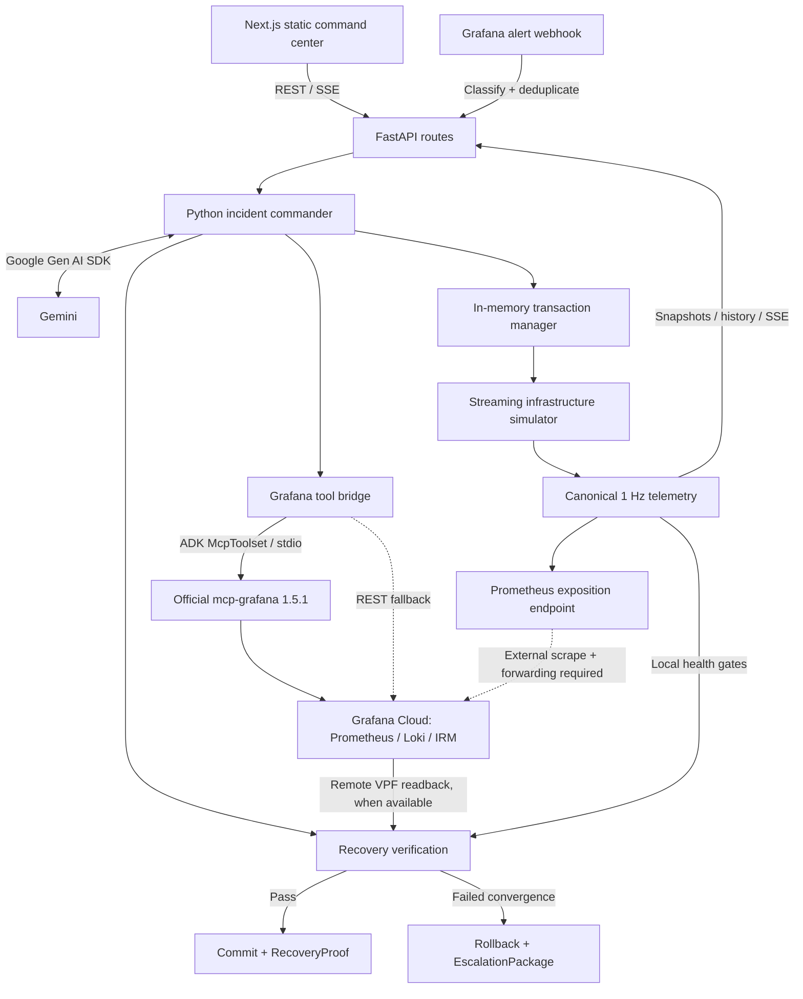
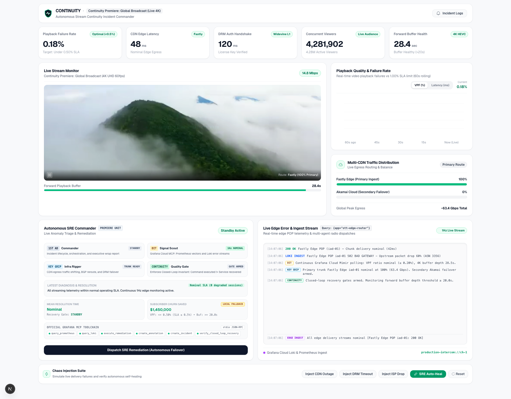

# CONTINUITY

**Closed-loop incident response for streaming reliability.**

[](backend/services/agent_commander.py)
[](backend/services/mcp_service.py)
[](backend/main.py)
[](frontend/package.json)

CONTINUITY investigates streaming failures, applies a remediation, and checks recovery before resolving an incident. It combines a Next.js command center, a FastAPI control plane, Gemini reasoning, and Grafana observability around one principle:

> **Command succeeded ≠ service recovered.**

**Current scope:** an executable SRE demonstration with simulated streaming telemetry and infrastructure, plus configurable Gemini and Grafana Cloud integrations. CDN traffic shifts, DRM failovers, BGP reroutes, viewer counts, and audience-impact estimates are modeled locally. This repository does not implement production CDN, DRM, or network-provider control adapters.

[Command center](https://continuity-sre.pages.dev) · [Backend API](https://continuity-api-121300560395.us-central1.run.app/) · [Grafana dashboard](https://joyfuljasmine1550.grafana.net/public-dashboards/4cf5f0a12aee4d48a3ed18abd2c03db7) · [Quick start](#quick-start) · [Architecture](#architecture)

*Hosted demo links are project entry points; their availability and integration health must be checked at runtime.*



*Existing application capture, showing a simulated healthy baseline. The preview footage and displayed audience are demonstration content, not evidence of a production broadcast or measured viewer load.*

## How it works

1. **Detect:** inject a supported failure or receive a Grafana alert webhook. Webhook ingestion classifies the alert, suppresses duplicates, updates simulation state, and launches investigation.
2. **Investigate:** query Prometheus and Loki through the official Grafana MCP server, with direct Grafana REST fallbacks. Gemini can select tool calls; the commander also has deterministic scenario fallbacks.
3. **Remediate:** record an in-memory transaction with the previous state, intended action, idempotency key, and rollback action; apply the change to the simulator.
4. **Verify:** poll recovery evidence and evaluate health gates. A successful transaction receives a `RecoveryProof` containing snapshots, gate results, and a SHA-256 evidence digest.
5. **Recover or escalate:** commit a verified recovery, or restore the simulation snapshot and assemble an `EscalationPackage`. Grafana annotations and IRM lifecycle updates depend on integration configuration and successful API responses.

## Architecture



| Component | Implementation | Responsibility |
|---|---|---|
| Command center | [Next.js / React / TypeScript](frontend/package.json), [API client](frontend/src/services/api.ts) | Static export, telemetry visualization, SSE subscription, chaos controls, incident history. |
| HTTP service | [FastAPI application](backend/main.py), [routes](backend/routes) | Telemetry, webhook ingestion, investigations, simulation mutations, health probes. |
| Incident commander | [agent_commander.py](backend/services/agent_commander.py) | Per-incident locks, Gemini calls, tool dispatch, scenario fallbacks, investigation results. |
| Observability bridge | [mcp_service.py](backend/services/mcp_service.py), [grafana_client.py](backend/services/grafana_client.py) | Official Grafana MCP tools via ADK `McpToolset`; direct REST fallback. |
| Recovery control | [transaction_manager.py](backend/services/transaction_manager.py), [models](backend/services/remediation_models.py) | Ledger, idempotency, scenario gates, evidence digest, rollback, escalation records. |
| Simulation | [chaos.py](backend/services/chaos.py), [telemetry.py](backend/services/telemetry.py), [scenarios.py](backend/services/scenarios.py) | Modeled infrastructure and a shared 1 Hz telemetry source. |
| Deployment | [Dockerfile](Dockerfile), [deploy.sh](deploy.sh), [Next.js config](frontend/next.config.ts) | Python 3.11 container with MCP binary; Cloud Run backend and separately hosted static frontend. |

The active reasoning path calls the Google Gen AI SDK and dispatches tools in Python. An ADK `Agent` and `Runner` are also constructed, but the investigation method does not execute the ADK runner. ADK's `McpToolset` provides the MCP integration.

### Grafana integration boundary

The container pins `grafana/mcp-grafana:1.5.1`. The agent-facing allowlist contains `query_prometheus`, `query_loki_logs`, `create_annotation`, `create_incident`, and `update_incident`. CONTINUITY's remediation, verification, rollback, and escalation functions are local custom tools.

The backend exposes simulation and agent metrics at `/api/telemetry/metrics`. Scraping and forwarding these metrics to Grafana Cloud requires external configuration; this repository does not include a collector deployment. A Loki push helper exists, but the telemetry ticker does not call it. UI log text alone does not establish successful Loki ingestion.

## Command center

The interface groups the workflow into four cinema-inspired roles. These are presentation roles within one commander workflow, not four independently deployed agents.

| Role | Responsibility |
|---|---|
| **1st AD · Commander** | Coordinates investigation and incident results. |
| **DIT · Signal scout** | Represents Prometheus and Loki evidence collection. |
| **Key Grip · Infrastructure rigger** | Represents simulated traffic, DRM, and transit remediation. |
| **Continuity · Quality gate** | Represents recovery verification, rollback, and escalation. |

<details>
<summary>View the full dashboard capture</summary>



*Historical application capture of the baseline layout. Financial savings and tool-status labels visible in this capture are illustrative UI content, not verified outcomes. The current source has evolved since this image was captured.*

</details>

The frontend also includes explicit `?stage=baseline`, `?stage=outage`, `?stage=gemini_modal`, `?stage=recovered`, and `?stage=pipeline` presentation fixtures in [page.tsx](frontend/src/app/page.tsx). Their timings, proof text, and telemetry are canned examples, not benchmark evidence.

## Recovery semantics

Recovery verification combines a Prometheus VPF readback with local simulation telemetry. Transaction gates are implemented in [transaction_manager.py](backend/services/transaction_manager.py):

| Gate | Required value | Scope |
|---|---|---|
| Video playback failures | ≤ 0.50% | All scenarios |
| Forward playback buffer | ≥ 20.0 seconds | All scenarios |
| CDN egress latency | ≤ 150.0 ms | CDN and secondary-path scenarios |
| DRM handshake | ≤ 250.0 ms | DRM scenario |
| Delivered bitrate | ≥ 10.0 Mbps | ISP scenario |

The outer verification loop also checks local VPF, CDN latency, and buffer health before transaction-specific verification. The chart's 1.00% VPF reference line is a presentation threshold; the recovery gate is 0.50%.

| `VERIFICATION_POLICY` | Behavior when remote VPF is unavailable |
|---|---|
| `remote_required` | Verification cannot pass without a remote Prometheus value. |
| `remote_preferred` (default) | Allows the local Prometheus collector registry as a fallback. |
| `local_allowed` | Also permits the local collector fallback. The implementation still attempts the remote read first. |

Results expose the verification source and an `authoritative` flag. That flag identifies remote Prometheus readback; other gates still use local telemetry. It does not mean every recovery signal was independently measured in production.

A `RecoveryProof` hashes the incident and transaction IDs, pre/post snapshots, gate results, and outcome. It is an evidence digest, not a digital signature, immutable storage guarantee, or independent attestation. Transactions, proofs, deduplication caches, and incident history are process-local and are lost on restart.

## Failure scenarios and recorded results

| Scenario | Simulated action | Expected outcome |
|---|---|---|
| Primary CDN outage | `SHIFT_TRAFFIC_TO_AKAMAI` | Recover after traffic rebalance and passing gates. |
| DRM timeout | `FAILOVER_DRM_KEY_CLUSTER` | Recover after key-cluster failover and passing gates. |
| ISP peering drop | `REROUTE_BGP_TRANSIT` | Recover after transit reroute and passing gates. |
| Secondary path degraded | Attempt CDN failover into a degraded path | Fail verification, roll back, and escalate. |

The checked-in [benchmark report](benchmarks/benchmark_report.json) records five runs per scenario:

| Scenario | Successful expected outcomes | Mean recovery time | False resolutions |
|---|---:|---:|---:|
| CDN failover | 4/5 (80%) | 6.42 s | 0 |
| DRM failover | 5/5 (100%) | 5.95 s | 0 |
| ISP reroute | 5/5 (100%) | 13.28 s | 0 |
| Adversarial double fault | 5/5 rollbacks with escalation | Not applicable | 0 |

These are saved simulation results, not a fresh run or a production SLA. The report's `all_passed: true` means no false resolutions were counted by the runner; it does **not** mean every recovery attempt succeeded. See [benchmark logic](benchmarks/run_scenarios.py).

## Quick start

### Requirements

- Python 3.11 for parity with the container.
- Node.js 20.9+ and npm for the frontend.
- Docker Compose for the simplest backend setup; the image includes the Grafana MCP binary.
- Gemini and Grafana credentials for external integrations. Use a Gemini model available to your account; the configured default in [config.py](backend/config.py) is not an availability guarantee.

```bash
git clone https://github.com/bobybarack/continuity-sre.git
cd continuity-sre
```

Create `.env` at the repository root; there is no checked-in `.env.example`:

```dotenv
GEMINI_API_KEY=your-gemini-api-key
GEMINI_MODEL=your-supported-gemini-model
GRAFANA_INSTANCE_URL=https://your-stack.grafana.net
GRAFANA_TOKEN=your-grafana-service-account-token
GRAFANA_PROM_UID=your-prometheus-datasource-uid
GRAFANA_LOKI_UID=your-loki-datasource-uid
VERIFICATION_POLICY=remote_preferred
CONTINUITY_DEMO_KEY=your-local-demo-write-key
```

Start the backend:

```bash
docker compose up --build
```

In a second terminal, configure and start the frontend:

```bash
cd frontend
npm ci
```

Create `frontend/.env.local`:

```dotenv
NEXT_PUBLIC_API_URL=http://localhost:8080
NEXT_PUBLIC_DEMO_KEY=your-local-demo-write-key
```

```bash
npm run dev
```

Open `http://localhost:3000`. Set the frontend URL explicitly: its source default points to the hosted backend. `NEXT_PUBLIC_DEMO_KEY` must match the backend write key and is visible in the browser bundle; it is a demo write guard, not user authentication. Keep Gemini and Grafana credentials on the backend.

### Native backend alternative

```bash
python3 -m venv .venv
.venv/bin/python -m pip install -r backend/requirements.lock
.venv/bin/uvicorn main:app --app-dir backend --reload --port 8000
```

For this option, set `NEXT_PUBLIC_API_URL=http://localhost:8000`. Install the official `mcp-grafana` executable on `PATH` or at `backend/bin/mcp-grafana` to use MCP. The native Python dependency install does not install that binary; supported Grafana calls can fall back to REST.

## API

FastAPI serves interactive OpenAPI documentation at `/docs` on the backend.

| Method | Route | Purpose |
|---|---|---|
| GET | `/healthz` | Process liveness; does not check Grafana connectivity. |
| GET | `/readyz` | Basic configuration readiness; does not authenticate external services. |
| GET | `/api/telemetry/grafana-health` | Attempt authenticated Grafana datasource discovery. |
| GET | `/api/telemetry/current` | Current canonical simulation snapshot. |
| GET | `/api/telemetry/history` | Rolling telemetry history. |
| GET | `/api/telemetry/stream` | SSE telemetry feed. |
| GET | `/api/telemetry/metrics` | Prometheus simulation and agent metrics. |
| GET | `/api/agent/status` | Agent configuration and investigation count. |
| GET | `/api/agent/mcp-tools` | Runtime MCP discovery and allowlist. |
| GET | `/api/agent/history` | In-memory investigation results. |
| POST | `/api/agent/investigate-and-remediate` | Run the commander workflow. |
| POST | `/api/alerts/grafana` | Ingest a Grafana alert and start a background workflow. |
| GET | `/api/chaos/state` | Read simulator state. |
| POST | `/api/chaos/inject-cdn-outage` | Inject a CDN outage. |
| POST | `/api/chaos/inject-drm-timeout` | Inject a DRM timeout. |
| POST | `/api/chaos/inject-isp-drop` | Inject an ISP drop. |
| POST | `/api/chaos/remediate` | Apply a direct simulator action; bypasses the commander transaction workflow. |
| POST | `/api/chaos/reset` | Restore the simulation baseline. |

Agent and chaos mutations use `X-Continuity-Demo-Key`. The webhook additionally accepts `X-Webhook-Secret`, bearer authorization, or its supported query parameters. Secondary-path degradation is available through the Python simulator and benchmark, with no dedicated HTTP injection route.

## Validation

Run focused local checks without relying on the parallel-test plugin assumed by `pytest.ini`:

```bash
.venv/bin/python -m pytest -o addopts='' -q \
  tests/test_scenarios.py \
  tests/test_chaos_state_machine.py \
  tests/test_remediation_transactions_rollback.py
```

The full suite and benchmark include integration paths that can call configured services and create Grafana records. Run them against a dedicated test stack:

```bash
.venv/bin/python -m pytest -o addopts='' -v tests/
.venv/bin/python benchmarks/run_scenarios.py
```

The benchmark replaces `benchmarks/benchmark_report.json`. No fixed passing-test count or CI status is asserted here.

## Deployment and operating limits

[deploy.sh](deploy.sh) runs the test suite, builds the container, and deploys it to Google Cloud Run. It contains a project ID, region, and service name specific to this demo; review those values and `.env` before running it.

The script sets `--min-instances 1`, `--max-instances 1`, and `--concurrency 80` for the process-local simulator. These settings do not provide durable storage, high availability, or state continuity across restarts and revision changes. The frontend is a separate Next.js static export (`npm run build` produces `frontend/out`); the script does not deploy it.

Production use would require persistent transaction and incident storage, coordinated concurrency, identity and authorization beyond the public demo key, real infrastructure adapters, and independently ingested recovery telemetry. The current implementation demonstrates the workflow and its recovery checks within the boundaries above.

## Repository guide

| Path | Contents |
|---|---|
| [backend/](backend) | API, configuration, integrations, simulation, and recovery control. |
| [frontend/](frontend) | Command center, API client, and presentation fixtures. |
| [tests/](tests) | Unit, workflow, concurrency, and integration tests. |
| [benchmarks/](benchmarks) | Scenario runner and saved results. |
| [docs/images/](docs/images) | Existing application screenshots used in this README. |
| [docker-compose.yml](docker-compose.yml) | Local backend container configuration. |
| [LICENSE](LICENSE) | Apache License 2.0. |
