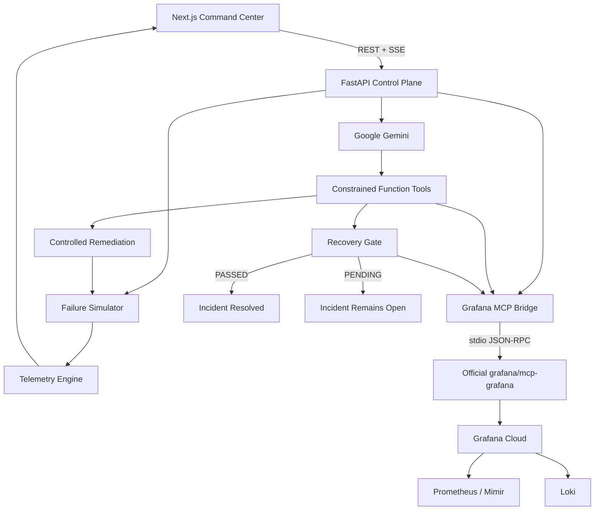

# CONTINUITY

### Autonomous closed-loop incident response for live streaming infrastructure

CONTINUITY is an agentic SRE prototype for high-concurrency streaming systems.

It connects Google Gemini, Grafana Cloud, the official Grafana MCP server, Prometheus/Mimir, Loki, and a constrained remediation control plane to automate the incident lifecycle:

```
Detect → Investigate → Diagnose → Remediate → Record → Verify
```

The project is built around one reliability principle:

> A remediation command succeeding does not prove that the service recovered.

CONTINUITY measures the system again after an autonomous action and only marks recovery when explicit health conditions pass.

---

## Live Demo

- **Command Center**: [https://continuity-sre.pages.dev](https://continuity-sre.pages.dev/)
- **Backend API**: [https://continuity-api-121300560395.us-central1.run.app](https://continuity-api-121300560395.us-central1.run.app/)
- **Grafana Cloud Dashboard**: [https://joyfuljasmine1550.grafana.net/public-dashboards/4cf5f0a12aee4d48a3ed18abd2c03db7](https://joyfuljasmine1550.grafana.net/public-dashboards/4cf5f0a12aee4d48a3ed18abd2c03db7)
- **Repository**: [https://github.com/bobybarack/continuity-sre](https://github.com/bobybarack/continuity-sre)

---

## Why CONTINUITY?

A streaming incident is often visible to the infrastructure long before anyone has fully diagnosed it.

During a major premiere, live event, game reveal, or sports broadcast, the observability stack may already contain signals such as:

- rising playback failures
- CDN latency spikes
- collapsing forward-buffer depth
- degraded delivered bitrate
- DRM authentication delays
- HTTP 502 / 504 responses
- routing or transit failures
- unhealthy traffic distribution

The difficult part is what happens after those signals appear.

A conventional workflow can look like this:

```
Alert ↓ Page engineer ↓ Open dashboards ↓ Inspect metrics ↓ Search logs ↓ Correlate evidence ↓ Identify failure mode ↓ Choose remediation ↓ Execute change ↓ Watch telemetry ↓ Confirm recovery
```

Every step is reasonable. The delay comes from requiring a person to manually carry context between each one.

CONTINUITY explores a narrower question:

> If the infrastructure already exposes the evidence required to understand an incident, how much of the response loop can be automated safely?

---

## What CONTINUITY Does

CONTINUITY implements six stages:

1. **Detect** abnormal streaming QoS
2. **Investigate** Prometheus metrics and Loki logs
3. **Diagnose** the failure with Gemini
4. **Remediate** through a constrained action surface
5. **Record** the incident in Grafana
6. **Verify** the post-remediation state

The last stage is what makes the system closed-loop.

> Command executed ≠ Service recovered

---

## Architecture



At a high level:

```
Streaming failure ↓ Prometheus + Loki evidence ↓ Grafana MCP ↓ Gemini reasoning ↓ Constrained remediation ↓ Grafana incident + annotation ↓ Prometheus-backed verification ↓ PASSED or PENDING
```

---

## 1. Detect

CONTINUITY exposes a Prometheus/OpenMetrics telemetry surface representing the viewer and edge-delivery experience.

Current metrics include:

| Metric | Description |
|---|---|
| `ott_video_playback_failures_ratio` | Current playback failure ratio |
| `ott_cdn_egress_latency_ms` | CDN response latency |
| `ott_drm_handshake_ms` | DRM license handshake duration |
| `ott_active_viewers_count` | Simulated concurrent audience |
| `ott_buffer_health_seconds` | Forward playback buffer |
| `ott_stream_bitrate_mbps` | Delivered video bitrate |
| `ott_cdn_traffic_split_percentage` | Traffic split by CDN |
| `ott_incident_active_status` | Active outage indicator |

Prometheus exposition is available at:
```http
GET /api/telemetry/metrics
```

Live frontend telemetry is streamed using Server-Sent Events:
```http
GET /api/telemetry/stream
```

The current anomaly gate checks conditions including:
- VPF > 1.0%
- CDN latency > 200 ms
- DRM handshake > 500 ms
- or an active injected outage

The detection threshold is intentionally separate from the stricter recovery threshold.

---

## 2. Investigate

When an anomaly is confirmed, CONTINUITY queries the observability layer.

The initial investigation calls:
- `grafana_query_prometheus`
- `grafana_query_loki`

The Grafana integration prefers the official Grafana MCP runtime.

Conceptually:
```
CONTINUITY ↓ MCP ClientSession ↓ stdio JSON-RPC ↓ mcp-grafana ↓ Grafana Cloud
```

- **Prometheus** provides the measurable infrastructure state.
- **Loki** provides the event context surrounding the failure.

The returned Grafana responses are included directly in the incident context supplied to Gemini. That means Gemini receives both:
- the structured application telemetry snapshot
- the raw Grafana Prometheus and Loki responses

rather than being asked to reason from a generic description of the failure.

### Official Grafana MCP Integration

CONTINUITY uses the official `grafana/mcp-grafana` runtime.

The bridge can:
- locate the installed `mcp-grafana` binary
- launch it over stdio
- initialize an MCP `ClientSession`
- dynamically enumerate available tools
- invoke official Grafana MCP operations
- return results to the CONTINUITY orchestration layer

Supported operations currently include:
- `query_prometheus`
- `query_loki_logs`
- `create_annotation`
- `create_incident`
- `search_dashboards`

The discovered tool catalog is exposed through:
```http
GET /api/agent/mcp-tools
```

This endpoint reports:
- connection status
- MCP binary path
- discovered tool count
- tool names and descriptions

CONTINUITY does not expose the entire discovered Grafana catalog directly to Gemini. The model receives a deliberately constrained function surface instead.

### Grafana API Fallback

If the official MCP runtime is unavailable or a supported MCP call fails, CONTINUITY can fall back to a direct Grafana Cloud client.

```
Primary path:   CONTINUITY ↓ official mcp-grafana ↓ Grafana Cloud
Fallback path:  CONTINUITY ↓ Grafana HTTP APIs ↓ Grafana Cloud
```

The direct client includes retry handling with exponential backoff for transient network and server errors.

---

## 3. Diagnose

Gemini provides the reasoning layer.

CONTINUITY uses Google's official `google-genai` Python SDK.

The model receives incident context including:
- active failure mode
- affected region
- playback failure rate
- CDN latency
- DRM handshake time
- buffer health
- delivered bitrate
- current infrastructure event
- raw Prometheus response
- raw Loki response

Gemini then reasons about:
- incident severity
- likely root cause
- affected subsystem
- appropriate remediation

### Constrained Gemini Function Calling

Gemini is not given arbitrary system access. The current function surface contains:
- `grafana_query_prometheus`
- `grafana_query_loki`
- `grafana_create_annotation`
- `grafana_create_incident`
- `continuity_execute_remediation`
- `continuity_verify_closed_loop_recovery`

These are passed through Google's native function-calling interface. When Gemini emits a function call, CONTINUITY dispatches it to the appropriate implementation.

This creates a deliberate separation between:
```
Reasoning ↓ Allowed tool selection ↓ Controlled execution
```

The design principle is:
> Reason broadly. Act narrowly. Verify everything.

### Hybrid Orchestration

CONTINUITY does not rely on the model to remember every lifecycle step.

Gemini can independently request tools, but the orchestration layer still guarantees critical stages such as:
- remediation
- incident creation
- dashboard annotation
- recovery verification

if the model does not invoke them itself.

The architecture is therefore hybrid:
```
Gemini reasoning + Native function calling + Deterministic orchestration + Explicit verification gate
```

This is intentional. Autonomous infrastructure should not depend entirely on probabilistic control flow.

---

## 4. Remediate

CONTINUITY exposes the constrained action:
```
continuity_execute_remediation
```

Current remediation policy names include:
- `SHIFT_TRAFFIC_TO_AKAMAI`
- `FAILOVER_DRM_KEY_CLUSTER`
- `REROUTE_BGP_TRANSIT`

The simulation begins with:
- Primary CDN: 100%
- Secondary CDN: 0%

After remediation, the current simulator transitions to:
- Primary CDN: 20%
- Secondary CDN: 80%

The model cannot issue arbitrary infrastructure commands. It chooses from explicit remediation policies supported by the backend.

---

## 5. Record

CONTINUITY writes the operational response back into Grafana.

Supported actions include:
- `grafana_create_incident`
- `grafana_create_annotation`

The system records:
- incident title
- severity
- diagnosis
- selected remediation
- timestamp
- dashboard annotation

If structured Grafana Incident Management creation is unavailable through the direct fallback path, the event is still preserved as a dedicated Grafana annotation. This keeps autonomous changes visible and auditable.

---

## 6. Verify

Verification is the defining part of CONTINUITY.

A basic automation flow might be:
```
Run remediation ↓ Function returned successfully ↓ Declare success
```

CONTINUITY instead performs:
```
Observe ↓ Reason ↓ Act ↓ Observe Again ↓ Verify
```

The recovery tool is:
```
continuity_verify_closed_loop_recovery
```

The verifier attempts a Prometheus read-back through the Grafana integration.
If a usable Grafana Cloud Prometheus value cannot be obtained, the current implementation falls back to the application's Prometheus `CollectorRegistry`.
If no Prometheus value can be obtained from either source, verification fails closed.

Recovery additionally requires the current client telemetry state to satisfy:

$$\text{VPF} \le 0.5\%$$
$$L_{\text{CDN}} \le 150\text{ ms}$$
$$B_{\text{forward}} \ge 20\text{ s}$$

where:
- $\text{VPF}$ = Video Playback Failure percentage
- $L_{\text{CDN}}$ = CDN egress latency
- $B_{\text{forward}}$ = forward playback buffer

The recovery predicate is:

$$\text{Recovered} = \text{PrometheusHealthy} \land \text{VPFHealthy} \land \text{LatencyHealthy} \land \text{BufferHealthy}$$

The tool returns either:
- `PASSED`
- or `PENDING`

along with verification metadata including:
- `prometheus_metric_value`
- `prometheus_source`
- `prometheus_value_available`
- `prometheus_authoritative`
- `verification_source_trusted`
- `current_vpf_pct`
- `forward_buffer_sec`
- `cdn_latency_ms`

If the gate is `PENDING`, CONTINUITY explicitly leaves the incident unresolved.

---

## Failure Scenarios

The project includes a controlled chaos simulator with three main failure modes.

### CDN Outage (`CDN_OUTAGE`)
Simulates:
- primary edge failure
- 502 Bad Gateway
- elevated playback failures
- high CDN latency
- buffer collapse
- delivered bitrate degradation

Typical simulated failure state:
- VPF ≈ 4.85%
- CDN latency ≈ 412 ms
- Forward buffer ≈ 3.4 s
- Bitrate ≈ 3.8 Mbps

### DRM Timeout (`DRM_TIMEOUT`)
Simulates:
- Widevine / FairPlay license delay
- key-acquisition timeout
- elevated DRM handshake latency
- resulting playback failures

Typical simulated handshake duration:
- ≈ 2450 ms

### ISP Peering Degradation (`ISP_PEERING_DROP`)
Simulates:
- Tier-1 transit congestion
- packet loss
- bitrate reduction
- elevated latency
- player quality downshift

The current synthetic scenario uses ASN 3356 as transit metadata.

---

## Command Center

The frontend is designed to show both sides of a streaming incident:
- what the infrastructure sees
- what the viewer experiences

The command center includes:
- live playback state
- VPF
- CDN latency
- DRM latency
- forward-buffer health
- delivered bitrate
- CDN traffic distribution
- recent edge events
- Gemini incident trace
- chaos controls
- recovery status

The demonstration flow is:
```
Healthy stream ↓ Inject failure ↓ QoS deteriorates ↓ Prometheus + Loki investigation ↓ Gemini analyzes evidence ↓ Controlled remediation ↓ Traffic state changes ↓ Prometheus-backed read-back ↓ Recovery gate ↓ Playback stabilizes
```

This makes the infrastructure problem visible without requiring the audience to interpret every metric before understanding its impact.

---

## Real vs. Simulated

This boundary is important. CONTINUITY is a working agentic infrastructure prototype. It is not a production streaming CDN.

### Real
The repository contains real implementations for:
- Google Gemini API calls
- Google GenAI native function calling
- official `grafana/mcp-grafana`
- MCP stdio sessions
- runtime MCP tool discovery
- Grafana Cloud connectivity
- Prometheus queries
- Loki queries
- Grafana annotations
- Grafana Incident Management integration
- direct Grafana API fallback
- Prometheus/OpenMetrics exposition
- FastAPI services
- Server-Sent Events
- Docker deployment
- Google Cloud Run packaging
- constrained action dispatch
- Prometheus-backed verification
- fail-closed verification when no Prometheus value is available
- thread-safe state mutation

### Simulated
The prototype simulates:
- millions of concurrent viewers
- commercial CDN traffic
- Fastly edge failures
- Akamai failover traffic
- ISP transit degradation
- DRM infrastructure failures
- playback QoS degradation
- CDN routing changes
- subscriber/business-impact estimates

No real Fastly, Akamai, ISP, DRM provider, studio, or streaming-service production infrastructure is controlled by this project.

---

## Safety Boundaries

Autonomous infrastructure systems need stronger control boundaries than conversational agents. CONTINUITY uses several.

- **Restricted tool surface**: Gemini receives specific function declarations. It does not receive arbitrary shell execution.
- **Predefined policies**: Remediation is selected from explicit backend policies.
- **Deterministic orchestration**: Critical lifecycle stages are enforced outside the model.
- **Post-action verification**: Execution alone is never treated as recovery.
- **Failed verification remains open**: A PENDING recovery gate does not become a resolved incident.
- **Audit trail**: The investigation result records:
  - reasoning trace
  - tools executed
  - remediation policy
  - traffic distribution
  - Grafana incident identifier
  - annotation identifier
  - elapsed time
  - recovery result

### Thread Safety

Several parts of the application interact with shared simulation state simultaneously:
- telemetry generation
- Prometheus scraping
- SSE clients
- chaos injection
- remediation
- agent execution

State mutations are protected using:
```python
threading.RLock()
```
The chaos manager returns deep copies of its state instead of exposing the internal mutable object directly.

### Resilience

CONTINUITY contains fallback behavior at multiple layers:
- **Gemini**: The agent can attempt fallback Gemini models if the configured model fails.
- **Grafana**: The preferred path uses official `mcp-grafana`. Supported operations fall back to direct Grafana APIs when MCP execution fails.
- **HTTP retries**: The direct Grafana client retries transient failures using exponential backoff.
- **Agent policy fallback**: If Gemini cannot produce a usable incident decision, the supported failure modes have deterministic fallback remediation policies.

This keeps the prototype operational while making the AI dependency explicit rather than pretending it cannot fail.

---

## Tech Stack

- **AI**: Google Gemini, Google GenAI Python SDK, native Gemini function calling
- **Agent / MCP**: Model Context Protocol, official Grafana `mcp-grafana`, MCP Python SDK, stdio JSON-RPC, constrained tool dispatcher
- **Observability**: Grafana Cloud, Prometheus / Mimir, Loki, Grafana annotations, Grafana Incident Management integration
- **Backend**: Python 3.11, FastAPI, Uvicorn, Pydantic, HTTPX, Prometheus Client, Server-Sent Events, `threading.RLock()`
- **Frontend**: Next.js 16.3.4, React 19.2.8, TypeScript, Tailwind CSS 4, Motion, Hugeicons
- **Infrastructure**: Docker, Docker Compose, Google Cloud Run, Cloudflare Pages
- **Testing**: Pytest, Pytest AsyncIO

---

## Repository Structure

```
continuity-sre/
├── backend/
│   ├── routes/
│   │   ├── agent.py
│   │   ├── chaos.py
│   │   └── telemetry.py
│   ├── services/
│   │   ├── agent_commander.py
│   │   ├── chaos.py
│   │   ├── grafana_client.py
│   │   ├── mcp_service.py
│   │   └── telemetry.py
│   ├── config.py
│   ├── main.py
│   └── requirements.txt
├── frontend/
├── tests/
├── docs/
├── devpost-gallery/
├── video-production/
├── Dockerfile
├── docker-compose.yml
├── deploy.sh
├── LICENSE
└── README.md
```

---

## API

### Agent
- `GET /api/agent/status`: Returns current agent configuration, including model configuration and investigation count.
- `GET /api/agent/mcp-tools`: Discovers the official Grafana MCP tool catalog at runtime.
- `POST /api/agent/investigate-and-remediate`: Executes the incident investigation and remediation workflow.
- `GET /api/agent/history`: Returns previous investigation results.

### Telemetry
- `GET /api/telemetry/current`: Current streaming snapshot.
- `GET /api/telemetry/history`: Recent rolling history.
- `GET /api/telemetry/grafana-health`: Grafana Cloud connectivity status.
- `GET /api/telemetry/metrics`: OpenMetrics / Prometheus scrape endpoint.
- `GET /api/telemetry/stream`: Real-time Server-Sent Events stream.

### Chaos
- `GET /api/chaos/state`: Current chaos state.
- `POST /api/chaos/inject-cdn-outage`: Inject CDN edge failure.
- `POST /api/chaos/inject-drm-timeout`: Inject DRM auth proxy delay.
- `POST /api/chaos/inject-isp-drop`: Inject BGP transit degradation.
- `POST /api/chaos/remediate`: Apply remediation policy.
- `POST /api/chaos/reset`: Reset state to normal.

---

## Local Development

### Prerequisites
- Python 3.11+
- Node.js & npm
- Gemini API key
- Grafana Cloud credentials for live observability operations
- For local official MCP execution, install the `mcp-grafana` binary or use the included Docker image.

### 1. Clone
```bash
git clone https://github.com/bobybarack/continuity-sre.git
cd continuity-sre
```

### 2. Configure Environment
Create a `.env` file in the repository root:
```bash
# Gemini
GEMINI_API_KEY=your_gemini_api_key
GEMINI_MODEL=models/gemini-3.6-flash

# Google Cloud
GOOGLE_CLOUD_PROJECT=your_project_id
GOOGLE_CLOUD_PROJECT_NUMBER=your_project_number

# Grafana Cloud
GRAFANA_INSTANCE_URL=https://your-stack.grafana.net
GRAFANA_TOKEN=your_service_account_token
GRAFANA_PROM_UID=your_prometheus_datasource_uid
GRAFANA_LOKI_UID=your_loki_datasource_uid
GRAFANA_TEMPO_UID=your_tempo_datasource_uid
```
Do not commit `.env`.

### 3. Backend
Create a virtual environment:
```bash
python3 -m venv .venv
source .venv/bin/activate
pip install -r backend/requirements.txt
```

Start the API:
```bash
uvicorn main:app --app-dir backend --host 0.0.0.0 --port 8000 --reload
```

- API: `http://localhost:8000`
- OpenAPI documentation: `http://localhost:8000/docs`

### 4. Frontend
```bash
cd frontend
npm install
npm run dev
```

---

## Docker

The repository uses a multi-stage Docker build. The first stage uses the official Grafana MCP image:
```dockerfile
FROM grafana/mcp-grafana:latest AS grafana-mcp
```
The MCP binary is copied into the Python runtime:
```dockerfile
COPY --from=grafana-mcp /app/mcp-grafana /usr/local/bin/mcp-grafana
```

Build:
```bash
docker build -t continuity-sre .
```

Run:
```bash
docker run --env-file .env -p 8080:8080 continuity-sre
```
Then open `http://localhost:8080`.

### Docker Compose
```bash
docker compose up --build
```
The API is exposed at `http://localhost:8080`.

---

## Testing

Run:
```bash
pytest -q
```

The test suite covers core backend paths around:
- telemetry
- failure injection
- remediation
- agent execution
- recovery verification
- concurrency-sensitive state

Test counts are intentionally not hard-coded here so the README does not become stale as the suite evolves.

---

## Google Cloud Run

A deployment script is included:
```bash
./deploy.sh
```

The deployment script:
1. validates `.env`
2. checks required Gemini and Grafana credentials
3. runs the automated test suite
4. configures the Google Cloud project
5. submits the container to Cloud Build
6. deploys the service to Cloud Run

The production container listens on `PORT=8080`.

---

## Configuration

| Variable | Purpose |
|---|---|
| `GEMINI_API_KEY` | Gemini API authentication |
| `GEMINI_MODEL` | Configured Gemini model |
| `GOOGLE_CLOUD_PROJECT` | Google Cloud project ID |
| `GOOGLE_CLOUD_PROJECT_NUMBER` | Google Cloud project number |
| `GRAFANA_INSTANCE_URL` | Grafana Cloud stack URL |
| `GRAFANA_TOKEN` | Grafana service-account token |
| `GRAFANA_PROM_UID` | Prometheus/Mimir datasource UID |
| `GRAFANA_LOKI_UID` | Loki datasource UID |
| `GRAFANA_TEMPO_UID` | Tempo datasource UID |

---

## Current Prototype Boundaries

CONTINUITY demonstrates an autonomous reliability architecture. It is not presented as a production CDN controller.

- **Simulated actuation**: Traffic shifts update CONTINUITY's internal routing state. They do not call Fastly or Akamai production APIs.
- **Fixed remediation outcome**: The current simulator transitions supported remediation policies into a common REMEDIATED state and applies the same 20/80 traffic split. A production implementation would use policy-specific adapters.
- **Prometheus verification sources**: Recovery verification prefers Grafana Cloud Prometheus. If that result is unavailable or cannot be parsed, the prototype can use its local Prometheus CollectorRegistry. If no Prometheus value can be obtained, verification fails. A production deployment could be configured to require the remote observability plane exclusively.
- **Business-impact values**: Viewer counts and subscriber-loss estimates shown in the demo are synthetic scenario metadata. They are not measured customer or revenue outcomes.
- **Demo security posture**: The current application is optimized for hackathon demonstration. A production deployment would additionally require authentication, authorization, restricted CORS, workload identities, secret management, action-level permissions, approval controls for high-impact remediation, and persistent incident storage.

---

## Production Evolution

- **Provider-specific actions**: Replace simulated routing mutations with authenticated infrastructure adapters for CDN traffic managers, DNS, load balancers, service meshes, DRM infrastructure, and cloud networking.
- **Authoritative remote verification**: Require recovery evidence from the production observability plane before incident closure.
  ```
  No authoritative read-back ↓ Recovery cannot be proven ↓ Incident stays open
  ```
- **Multi-turn tool reasoning**: The current implementation seeds Gemini with Grafana evidence and supports native function calls. A deeper agent loop could continuously feed every tool result back into the next Gemini reasoning turn:
  ```
  Gemini ↓ query_prometheus ↓ Result ↓ Gemini ↓ query_loki_logs ↓ Result ↓ Gemini ↓ Remediation decision
  ```
- **Human escalation**: Autonomy needs a stopping condition. If recovery cannot be verified within a defined window, CONTINUITY should stop making changes and escalate with incident classification, Prometheus evidence, Loki evidence, remediation attempted, current health state, and recommended next investigation step.
- **Predictive response**: CONTINUITY currently reacts after degradation is detected. A future system could reason over $\frac{d(\text{VPF})}{dt}$ and $\frac{dB_{\text{forward}}}{dt}$ to detect an approaching failure before playback interruption occurs.

---

## Design Principles

- **Ground the model**: Give the reasoning layer observable evidence rather than a vague alert.
- **Restrict the action surface**: Models should choose from explicit, auditable operations.
- **Separate action from success**: A successful command is not proof of recovery.
- **Observe again**: Every remediation should be followed by another measurement cycle.
- **Fail closed when recovery cannot be proven**: An unknown state should not become a successful state.
- **Preserve an audit trail**: Automated actions must remain inspectable afterward.
- **Escalate when certainty ends**: Autonomy should stop when the system can no longer prove that its actions restored health.

---

## Reliability Model

Let $S_t$ represent the infrastructure state before remediation.
Let $A_t$ represent the remediation action.

The action produces:

$$S_{t+1} = f(S_t, A_t)$$

Execution of $A_t$ is not the success condition. The system only considers the action successful if:

$$S_{t+1} \in S_{\text{healthy}}$$

That changes the common agent loop from:

$$\text{Observe} \to \text{Think} \to \text{Act}$$

to:

$$\text{Observe} \to \text{Think} \to \text{Act} \to \text{Observe Again} \to \text{Verify}$$

That is the central idea behind CONTINUITY.

---

## Hackathon

CONTINUITY was built for **Agentic Cinema: The Blockbuster Hackathon**, with a focus on the **Grafana Labs** partner track.

The project explores how agentic systems can reduce the distance between observability and action without giving an LLM unrestricted control over production infrastructure.

---

## Disclaimer

CONTINUITY is an independent engineering prototype. References to Fastly, Akamai, Widevine, FairPlay, Grafana, Google, film titles, studios, streaming platforms, and network providers are used to model or demonstrate infrastructure scenarios. Unless explicitly stated otherwise, those references do not imply affiliation, endorsement, partnership, or access to the companies' production infrastructure.

---

## License

Licensed under the Apache License 2.0. See [LICENSE](LICENSE).

---

### CONTINUITY
*Systems fail. The important part is what happens next.*

CONTINUITY turns observable failure into controlled action—and controlled action back into measurable evidence of recovery.
