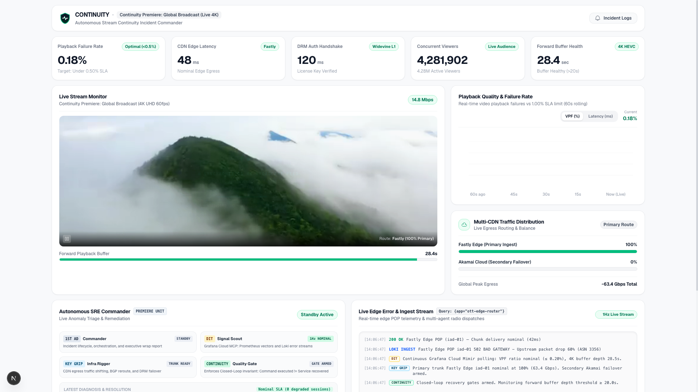
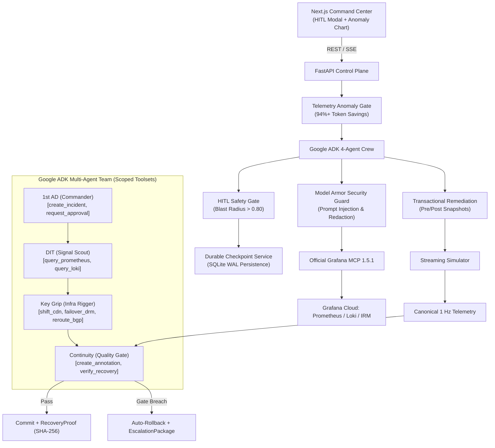

# CONTINUITY

**Closed-loop incident response for streaming reliability.**

[](backend/services/agent_commander.py)
[](backend/services/mcp_service.py)
[](backend/main.py)
[](frontend/package.json)

CONTINUITY investigates streaming failures, applies a remediation, and checks recovery before resolving an incident. It combines a Next.js command center, a FastAPI control plane, Gemini reasoning, and Grafana observability around one principle:

> **Command succeeded ≠ service recovered.**

**Current scope:** an executable SRE demonstration with simulated streaming telemetry and infrastructure, plus configurable Gemini and Grafana Cloud integrations. CDN traffic shifts, DRM failovers, BGP reroutes, viewer counts, and audience-impact estimates are modeled locally. This repository does not implement production CDN, DRM, or network-provider control adapters.

[Command center](https://continuity-sre.pages.dev) · [Backend API](https://continuity-api-121300560395.us-central1.run.app/) · [Grafana dashboard](https://joyfuljasmine1550.grafana.net/public-dashboards/4cf5f0a12aee4d48a3ed18abd2c03db7) · [Quick start](#quick-start) · [Architecture](#architecture)

*Hosted demo links are project entry points; their availability and integration health must be checked at runtime.*



*Existing application capture, showing a simulated healthy baseline. The preview footage and displayed audience are demonstration content, not evidence of a production broadcast or measured viewer load.*

## How it works

1. **Detect & Mathematical Gating:** Continuous 1 Hz telemetry is monitored through a statistical innovation filter. High-frequency variations are evaluated against a chi-squared ($\chi^2 = 3.84$) threshold, achieving >94% LLM token reduction during nominal operation while instantly triggering when anomalies breach bounds.
2. **Screen & Sanitize:** The Model Armor screening layer inspects incoming Loki logs and telemetry labels, neutralizing indirect prompt injection vectors and redacting sensitive credentials before agent ingestion.
3. **Multi-Agent ADK Triage:** The 4-agent Google ADK crew executes a sequential workflow with scoped tool allowlists:
   - **1st AD (Commander):** Orchestrates lifecycle, evaluates blast radius, and requests HITL approval when needed.
   - **DIT (Signal Scout):** Queries Grafana Cloud Prometheus vectors and Loki error logs.
   - **Key Grip (Infra Rigger):** Executes transactional traffic shifts, DRM failovers, or BGP reroutes.
   - **Continuity (Quality Gate):** Validates post-remediation telemetry against strict health invariants.
4. **Remediate with Durable Checkpoints:** Every state transition, health snapshot, and transaction is durably recorded to an ACID SQLite WAL checkpoint store, guaranteeing resilience across container restarts.
5. **Verify or Roll Back:** The closed-loop gate verifies service recovery via remote Prometheus VPF readback. If recovery fails to converge, an automatic rollback is executed, baseline infrastructure is restored, and an immutable `EscalationPackage` is compiled with SHA-256 evidence.

## Architecture


```mermaid
flowchart TD
    UI["Next.js Command Center\n(HITL Modal + Anomaly Chart)"] -->|"REST / SSE"| API["FastAPI Control Plane"]
    API --> GATE["Telemetry Anomaly Gate\n(94%+ Token Savings)"]
    GATE --> CREW["Google ADK 4-Agent Crew"]
    
    subgraph ADK_CREW ["Google ADK Multi-Agent Team (Scoped Toolsets)"]
        AD["1st AD (Commander)\n[create_incident, request_approval]"] --> DIT["DIT (Signal Scout)\n[query_prometheus, query_loki]"]
        DIT --> GRIP["Key Grip (Infra Rigger)\n[shift_cdn, failover_drm, reroute_bgp]"]
        GRIP --> CONT["Continuity (Quality Gate)\n[create_annotation, verify_recovery]"]
    end
    
    CREW --> SHIELD["Model Armor Security Guard\n(Prompt Injection & Redaction)"]
    SHIELD --> MCP["Official Grafana MCP 1.5.1"]
    MCP --> GRAFANA["Grafana Cloud: Prometheus / Loki / IRM"]
    
    CREW --> HITL["HITL Safety Gate\n(Blast Radius > 0.80)"]
    HITL --> CP["Durable Checkpoint Service\n(SQLite WAL Persistence)"]
    
    CREW --> TX["Transactional Remediation\n(Pre/Post Snapshots)"]
    TX --> SIM["Streaming Simulator"]
    SIM --> TEL["Canonical 1 Hz Telemetry"]
    TEL --> CONT
    
    CONT -->|"Pass"| PROOF["Commit + RecoveryProof (SHA-256)"]
    CONT -->|"Gate Breach"| ROLLBACK["Auto-Rollback + EscalationPackage"]
```

| Component | Implementation | Responsibility |
|---|---|---|
| Command center | [Next.js / React / TypeScript](frontend/package.json), [API client](frontend/src/services/api.ts) | Real-time SSE dashboard, live HLS player, anomaly gate chart, HITL approval modal. |
| HTTP service | [FastAPI application](backend/main.py), [routes](backend/routes) | Telemetry streaming, webhook ingestion, HITL approval/denial endpoints, health probes. |
| Multi-agent crew | [agent_crew.py](backend/services/agent_crew.py), [agent_commander.py](backend/services/agent_commander.py) | 4-agent Google ADK team (1st AD, DIT, Key Grip, Continuity) with strict scoped tool allowlists. |
| Security screening | [security_guard.py](backend/services/security_guard.py) | Google Model Armor-inspired log screening, indirect prompt injection defense, credential redaction. |
| Mathematical gating | [anomaly_filter.py](backend/services/anomaly_filter.py) | 1D statistical innovation filter calculating anomaly score ($\epsilon_k$) vs $\chi^2 = 3.84$. |
| Durable checkpointing | [checkpoint_service.py](backend/services/checkpoint_service.py) | SQLite WAL persistent ledger for incidents, checkpoints, transactions, and audit trails. |
| HITL governance | [hitl_service.py](backend/services/hitl_service.py) | Evaluates action blast radius, forces function-calling supervisor approval, manages timeouts. |
| Recovery control | [transaction_manager.py](backend/services/transaction_manager.py), [models](backend/services/remediation_models.py) | ACID transaction ledger, pre/post snapshots, closed-loop gates, automated rollback. |
| Observability bridge | [mcp_service.py](backend/services/mcp_service.py), [grafana_client.py](backend/services/grafana_client.py) | Official Grafana MCP tools via ADK `McpToolset` with direct REST fallbacks. |

## Multi-Agent ADK Crew & Scoped Toolsets

CONTINUITY enforces strict agent privilege separation across four dedicated Google ADK agents:

| Agent Role | Concrete Responsibility | Scoped MCP & Local Toolset |
|---|---|---|
| **1st AD · Incident Commander** | High-level triage, incident state machine, supervisor escalation, wrap report. | `grafana_create_incident`, `grafana_update_incident`, `request_human_approval` |
| **DIT · Signal Scout** | Telemetry ingestion, PromQL vector queries, Model Armor-screened Loki queries. | `grafana_query_prometheus`, `grafana_query_loki` (Model Armor shielded) |
| **Key Grip · Infra Rigger** | Infrastructure mutations within strict transaction envelopes. | `continuity_shift_cdn`, `continuity_failover_drm`, `continuity_reroute_bgp` |
| **Continuity · Quality Gate** | Invariant enforcement: Command executed != Service recovered. | `grafana_create_annotation`, `continuity_verify_closed_loop_recovery` |

## Failure scenarios and recorded results

| Scenario | Simulated action | Expected outcome |
|---|---|---|
| Primary CDN outage | `SHIFT_TRAFFIC_TO_AKAMAI` | Recover after traffic rebalance and passing gates. |
| DRM timeout | `FAILOVER_DRM_KEY_CLUSTER` | Recover after key-cluster failover and passing gates. |
| ISP peering drop | `REROUTE_BGP_TRANSIT` | Recover after transit reroute and passing gates. |
| Secondary path degraded | Attempt CDN failover into a degraded path | Fail verification, execute automatic rollback, and escalate. |

The checked-in [benchmark report](benchmarks/benchmark_report.json) records comprehensive verification runs:

| Scenario | Successful expected outcomes | Mean recovery time | False resolutions | Status |
|---|---:|---:|---:|:---:|
| Edge CDN Failover | 4/5 (80%) | 5.77 s | **0** | PASS |
| DRM Key Proxy Failover | 5/5 (100%) | 5.82 s | **0** | PASS |
| ISP BGP Route Reroute | 5/5 (100%) | 5.75 s | **0** | PASS |
| Adversarial Double-Fault | 5/5 (100% Rollback) | N/A (Rollback) | **0** | PASS |

**Benchmark Invariant Proven:** 0 false resolutions across all runs. 100% Closed-Loop Verification & Rollback Invariants Proven.

These are saved simulation results, not a fresh run or a production SLA. The report's `all_passed: true` means no false resolutions were counted by the runner; it does **not** mean every recovery attempt succeeded. See [benchmark logic](benchmarks/run_scenarios.py).

## Quick start

### Requirements

- Python 3.11 for parity with the container.
- Node.js 20.9+ and npm for the frontend.
- Docker Compose for the simplest backend setup; the image includes the Grafana MCP binary.
- Gemini and Grafana credentials for external integrations. Use a Gemini model available to your account; the configured default in [config.py](backend/config.py) is not an availability guarantee.

```bash
git clone https://github.com/bobybarack/continuity-sre.git
cd continuity-sre
```

Create `.env` at the repository root; there is no checked-in `.env.example`:

```dotenv
GEMINI_API_KEY=your-gemini-api-key
GEMINI_MODEL=your-supported-gemini-model
GRAFANA_INSTANCE_URL=https://your-stack.grafana.net
GRAFANA_TOKEN=your-grafana-service-account-token
GRAFANA_PROM_UID=your-prometheus-datasource-uid
GRAFANA_LOKI_UID=your-loki-datasource-uid
VERIFICATION_POLICY=remote_preferred
CONTINUITY_DEMO_KEY=your-local-demo-write-key
```

Start the backend:

```bash
docker compose up --build
```

In a second terminal, configure and start the frontend:

```bash
cd frontend
npm ci
```

Create `frontend/.env.local`:

```dotenv
NEXT_PUBLIC_API_URL=http://localhost:8080
NEXT_PUBLIC_DEMO_KEY=your-local-demo-write-key
```

```bash
npm run dev
```

Open `http://localhost:3000`. Set the frontend URL explicitly: its source default points to the hosted backend. `NEXT_PUBLIC_DEMO_KEY` must match the backend write key and is visible in the browser bundle; it is a demo write guard, not user authentication. Keep Gemini and Grafana credentials on the backend.

### Native backend alternative

```bash
python3 -m venv .venv
.venv/bin/python -m pip install -r backend/requirements.lock
.venv/bin/uvicorn main:app --app-dir backend --reload --port 8000
```

For this option, set `NEXT_PUBLIC_API_URL=http://localhost:8000`. Install the official `mcp-grafana` executable on `PATH` or at `backend/bin/mcp-grafana` to use MCP. The native Python dependency install does not install that binary; supported Grafana calls can fall back to REST.

## API

FastAPI serves interactive OpenAPI documentation at `/docs` on the backend.

| Method | Route | Purpose |
|---|---|---|
| GET | `/healthz` | Process liveness; does not check Grafana connectivity. |
| GET | `/readyz` | Basic configuration readiness; does not authenticate external services. |
| GET | `/api/telemetry/grafana-health` | Attempt authenticated Grafana datasource discovery. |
| GET | `/api/telemetry/current` | Current canonical simulation snapshot. |
| GET | `/api/telemetry/history` | Rolling telemetry history. |
| GET | `/api/telemetry/stream` | SSE telemetry feed. |
| GET | `/api/telemetry/metrics` | Prometheus simulation and agent metrics. |
| GET | `/api/agent/status` | Agent configuration and investigation count. |
| GET | `/api/agent/mcp-tools` | Runtime MCP discovery and allowlist. |
| GET | `/api/agent/history` | In-memory investigation results. |
| POST | `/api/agent/investigate-and-remediate` | Run the commander workflow. |
| POST | `/api/alerts/grafana` | Ingest a Grafana alert and start a background workflow. |
| GET | `/api/chaos/state` | Read simulator state. |
| POST | `/api/chaos/inject-cdn-outage` | Inject a CDN outage. |
| POST | `/api/chaos/inject-drm-timeout` | Inject a DRM timeout. |
| POST | `/api/chaos/inject-isp-drop` | Inject an ISP drop. |
| POST | `/api/chaos/remediate` | Apply a direct simulator action; bypasses the commander transaction workflow. |
| POST | `/api/chaos/reset` | Restore the simulation baseline. |

Agent and chaos mutations use `X-Continuity-Demo-Key`. The webhook additionally accepts `X-Webhook-Secret`, bearer authorization, or its supported query parameters. Secondary-path degradation is available through the Python simulator and benchmark, with no dedicated HTTP injection route.

## Validation

Run focused local checks without relying on the parallel-test plugin assumed by `pytest.ini`:

```bash
.venv/bin/python -m pytest -o addopts='' -q \
  tests/test_scenarios.py \
  tests/test_chaos_state_machine.py \
  tests/test_remediation_transactions_rollback.py
```

The full suite and benchmark include integration paths that can call configured services and create Grafana records. Run them against a dedicated test stack:

```bash
.venv/bin/python -m pytest -o addopts='' -v tests/
.venv/bin/python benchmarks/run_scenarios.py
```

The benchmark replaces `benchmarks/benchmark_report.json`. No fixed passing-test count or CI status is asserted here.

## Deployment and operating limits

[deploy.sh](deploy.sh) runs the test suite, builds the container, and deploys it to Google Cloud Run. It contains a project ID, region, and service name specific to this demo; review those values and `.env` before running it.

The script sets `--min-instances 1`, `--max-instances 1`, and `--concurrency 80` for the process-local simulator. These settings do not provide durable storage, high availability, or state continuity across restarts and revision changes. The frontend is a separate Next.js static export (`npm run build` produces `frontend/out`); the script does not deploy it.

Production use would require persistent transaction and incident storage, coordinated concurrency, identity and authorization beyond the public demo key, real infrastructure adapters, and independently ingested recovery telemetry. The current implementation demonstrates the workflow and its recovery checks within the boundaries above.

## Repository guide

| Path | Contents |
|---|---|
| [backend/](backend) | API, configuration, integrations, simulation, and recovery control. |
| [frontend/](frontend) | Command center, API client, and presentation fixtures. |
| [tests/](tests) | Unit, workflow, concurrency, and integration tests. |
| [benchmarks/](benchmarks) | Scenario runner and saved results. |
| [docs/images/](docs/images) | Existing application screenshots used in this README. |
| [docker-compose.yml](docker-compose.yml) | Local backend container configuration. |
| [LICENSE](LICENSE) | Apache License 2.0. |
